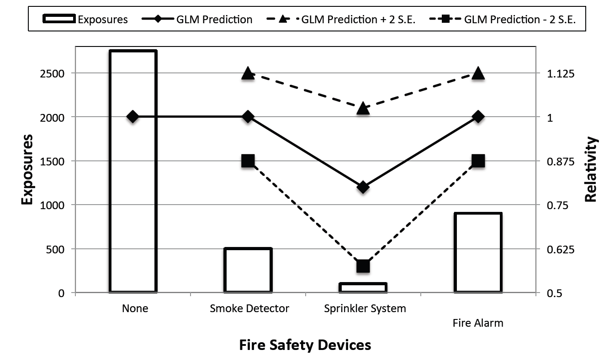

# 2011 Exam 5 - Q13

**Points:** 1

## Question

A company applied generalized linear modeling to its homeowners data. A graph of indicated relativities and their standard errors for a fire safety device rating variable is shown below.

Evaluate the effectiveness of the variable in the model.

## Solution

Since the 2 standard errors surrounding each estimate all contain the relativity of 1, there is no statistically significant difference between the relativities for any of the fire safety devices and not having a fire safety device. Even the GLM predicted relativity is 1.00 for 3 of the 4 levels that contain the most data. While it may be possible that a discount is warranted for a sprinkler system, there is a low volume of data, so it isn't statistically significant. As such, this variable is probably not worth using.

