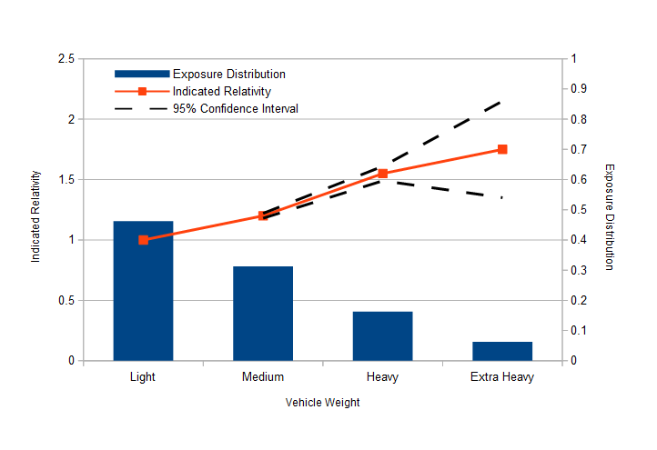
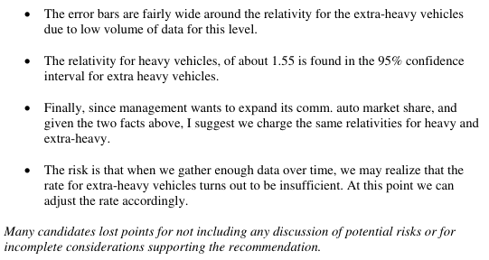

# 2012 Exam 5 - Q11

**Points:** 1.5

## Question

An insurer uses several rating variables, including vehicle weight, to determine premium charges for commercial automobiles. Your manager has requested a review of the vehicle weight rating relativities. The following diagnostic chart displays the results for vehicle weight from a generalized linear model.

## Solution

Looking at the graph, the indicated relativity for extra-heavy weight vehicles is higher than for heavy vehicles, but the 95% confidence interval around the extra-heavy weight estimate is quite wide due to the low volume of data. In fact, the 95% confidence interval for extra-heavy vehicles includes the indicated relativity for heavy vehicles. As such, it would be reasonable from a statistical significance perspective to charge the same weight for heavy and extra-heavy weight vehicles.

I would recommend that we do charge the same rate for heavy and extra-heavy vehicles since management wants to grow the extra-heavy segment of the market. The potential risk is that extra-heavy vehicles truly should be charged a higher rate, and we would be writing them at an inadequate rate. However, they currently represent a small portion of the book, so it should not dramatically impact the overall results (unless growth is substantial in this segment). Furthermore, by writing more of the extra-heavy vehicles, we would be gaining more data for that class, so we could produce more reliable indicated relativities for this group in the future and can adjust our rates accordingly.

## Examiner Report

Company management plans to expand its commercial auto market share with an emphasis on writing more businesses that operate with extra-heavy weight vehicles. Management wants to charge the same rates for both heavy and extra-heavy weight vehicles.

Based on the model results, provide your recommendation to management and explain the considerations supporting your position. Include a discussion of any potential risks associated with

### Part it

Examiner report solution and commentary:

