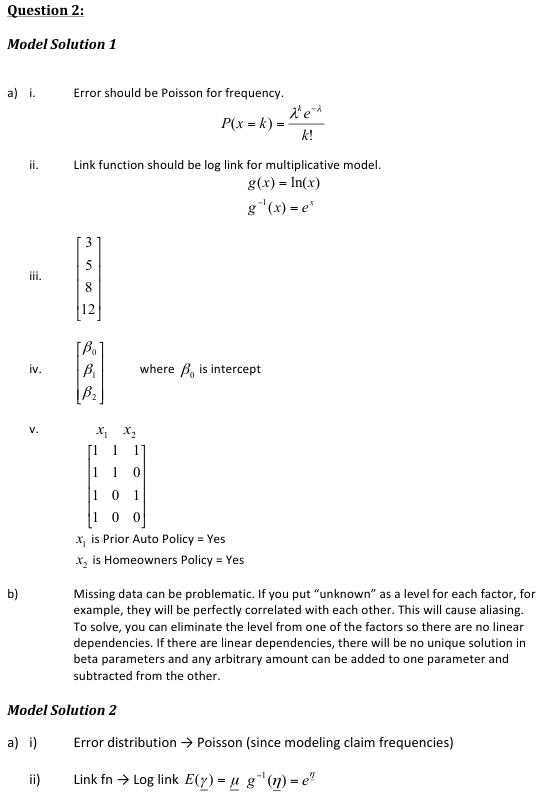
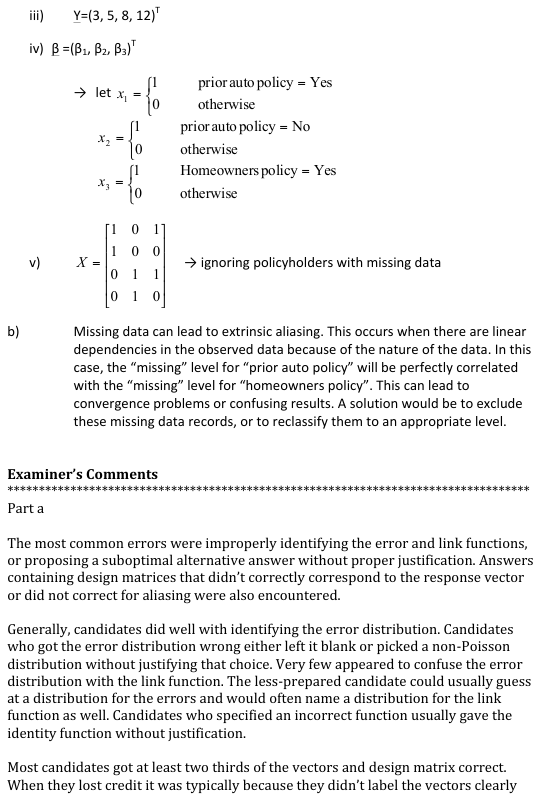
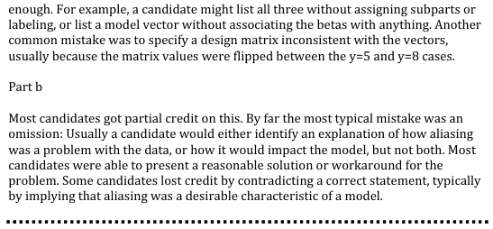

# 2012 Exam 8 - Q2

**Points:** 2.25

## Question

A private passenger auto insurance company orders a report whenever it writes a policy, showing what other insurance the policyholder has purchased. The following table shows claim frequencies (per 100 earned car-years) for bodily injury liability coverage, split by whether the policyholder has a homeowners policy and whether the policyholder had a prior auto policy:

Homeowners Policy

| Prior Auto Policy | Yes | No |
| --- | --- | --- |
| Yes | 3 | 5 |
| No | 8 | 12 |

The table does not include the experience of policyholders with missing data.

### Part a (1.25 pts)

Specify the following structural components of a generalized linear model that estimates frequencies for this book of business.

i. Error distribution

ii. Link function

iii. Vector of responses

iv. Vector of model parameters

v. Design matrix

### Part b (1.00 pts)

Describe how the missing data may cause problems for the company in developing the model, and suggest a solution.

## Solution

### Part a

i. The error distribution for frequency should be Poisson (or Negative Binomial).

ii. The link function should be a log link function.

Y

| J | N |
| --- | --- |
| iii. Observation 1: Prior Auto Policy = Yes, Homeowners = Yes | 3 |
| Observation 2: Prior Auto Policy = Yes, Homeowners = No | 5 |
| Observation 3: Prior Auto Policy = No, Homeowners = Yes | 8 |
| Observation 4: Prior Auto Policy = No, Homeowners = No | 12 |

iv. The solution requires 3 parameters, so you could label them anything you want, as long as you have

3 of them.

Beta Beta0 Beta1 Beta2

v. Let x1 be Prior Auto Policy=Yes

Let x2 be Homeowners Policy=Yes

Note that the order of observations here should be the same as for the vector of responses.

| J | K | L | M |
| --- | --- | --- | --- |
| X | 1 | 1 | 1 |
|  | 1 | 1 | 0 |
|  | 1 | 0 | 1 |
|  | 1 | 0 | 0 |

### Part b

Missing data can lead to convergence problems or confusing results. A solution would be to exclude these missing data records, or to reclassify them to an appropriate level.

## Examiner Report

Examiner report solutions and commentary:

