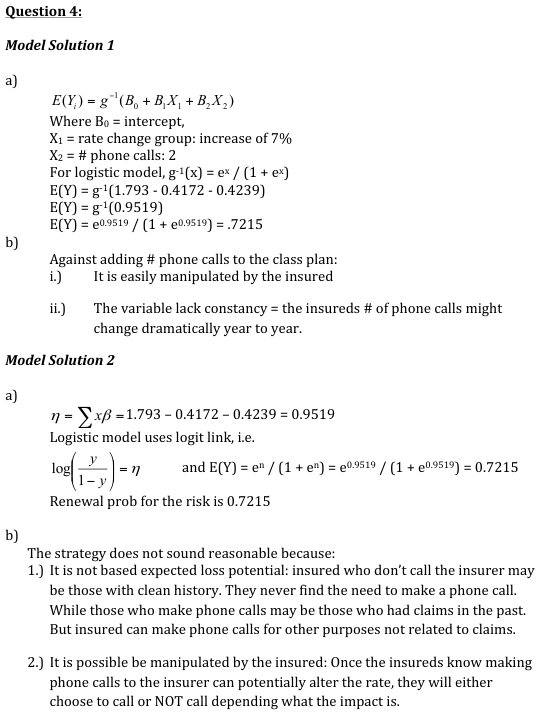
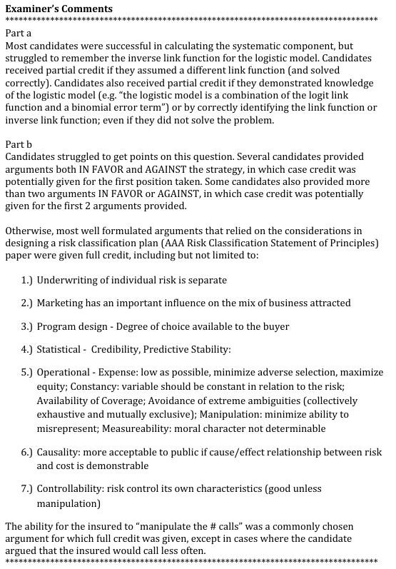

# 2012 Exam 8 - Q4

**Points:** 1.75

## Question

An actuary has historical information relating to customer retention. A logistic model was used to estimate the probability of renewal for a given customer. The two variables determined to be significant were the size of rate change and number of phone calls the insured made to the company. The parameter estimates were determined to be as follows:

| Rate Change | Parameter Estimate |
| --- | --- |
| Decrease to 3.9% increase | 0.3323 |
| 4.0% to 6.9% increase | 0 |
| Increase of 7.0% or more | -0.4172 |

## Solution

### Part a

| I | J |
| --- | --- |
| linear predictor | 0.9519 |
| Renewal probability | 72.15% |

Formulas

- `J2` = `=D19+D12+D17`
- `J3` = `=1/(1+EXP(-J2))`

### Part b

I would be against adding the number of phone calls to the classification plan because:

i. It can be easily manipulated by the insured

ii. The variable lacks constancy in that the number of phone calls for an insured might change

dramatically from year to year.

Other appropriate reasons that rely on ASOP 12 are also acceptable.

## Examiner Report

| Number of Phone Calls in Past Year | Parameter Estimate |
| --- | --- |
| 0 | 0 |
| 1 | -0.2128 |
| 2+ | -0.4239 |

**Intercept Term:** 1.793

### Part a (0.75 pts)

Calculate the renewal probability for a customer who has a 7% rate increase and called the company twice in the past year.

### Part b (1.00 pts)

The company needs policyholder retention to be above 78% to maintain growth and expense ratio goals. A possible strategy is to add the number of phone calls to the classification plan and use the model results to determine the rate increase.

Construct an argument either in favor of or against the strategy above, describing two reasons for that position.

Examiner report solutions and comments:

