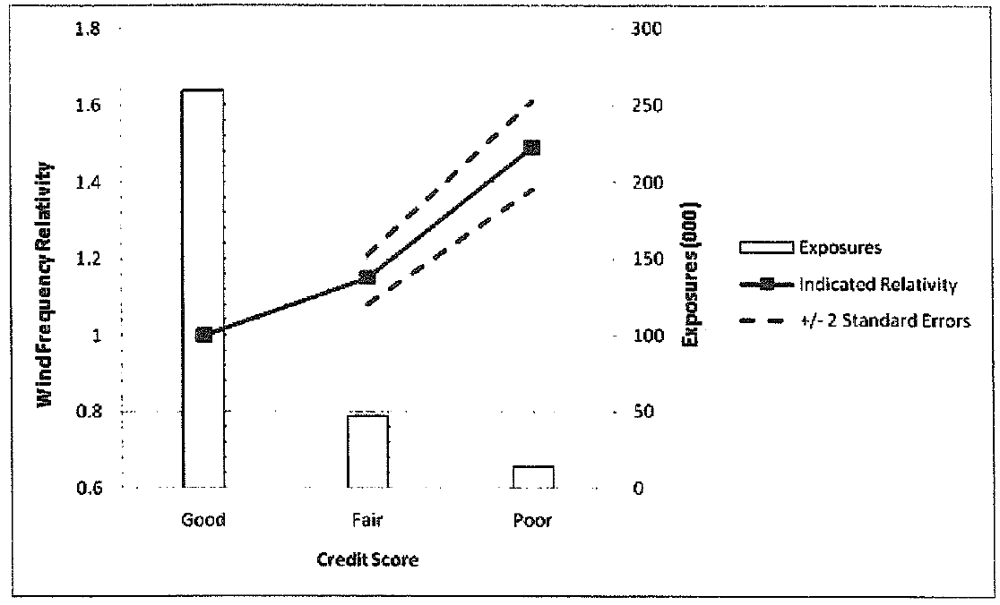
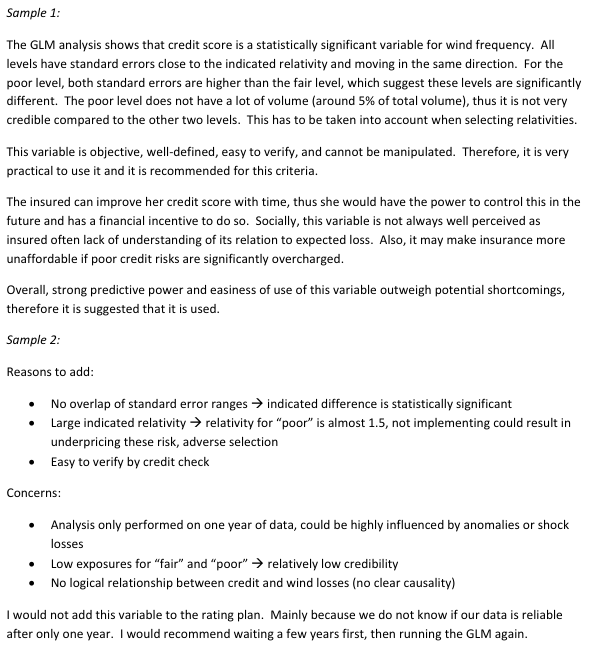
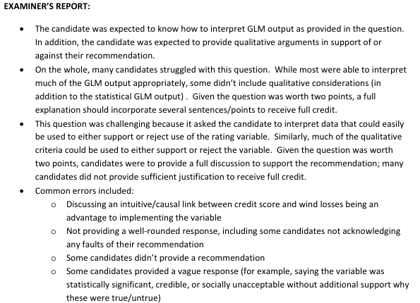

# Spring 2014 Exam 5 - Q9

**Points:** 2

## Question

An insurer is considering using credit score to further segment its homeowners book of business. The insurer has developed a generalized linear model to evaluate different variables' contribution to expected frequency of wind claims.

The following diagnostic chart displays the results of a countrywide analysis performed on one year of data from a generalized linear model:

**Combined bar and line chart: wind frequency relativity by credit score.** Left axis = Wind Frequency Relativity (0.6 to 1.8), right axis = Exposures in thousands (0 to 300), categories Good / Fair / Poor.

| Credit score | Indicated relativity | Approx. exposures | +/- 2 standard errors |
| --- | --- | --- | --- |
| Good | 1.00 | ~255,000 | very tight |
| Fair | 1.15 | ~48,000 | ~1.12 to ~1.19 |
| Poor | 1.49 | ~13,000 | ~1.36 to ~1.62 |

The confidence band widens sharply as exposure volume falls.

Using the generalized linear model output, as well as other considerations, justify whether the insurer should add credit score to the homeowners rating plan for the wind peril.

## Solution

You can make a reasonable argument either way in terms of whether to implement the variable.

Solution 1: Implement the variable

From the graph we can see that a worse credit score is correlated with a higher frequency of wind claims, and there is a notable difference in frequency between credit scores. Also, since the standard error range around the estimates is quite small, the trend is statistically significant. In addition, the prediction for each credit score is outside of the standard error ranges for the other credit scores, giving an even stronger indication that the different credit score levels have different frequencies of wind claims.

Credit score as a rating variable is an objective variable, and is easy to obtain and verify through credit reports. It is also difficult to manipulate. Finally, even though there are some social objections to using credit as a variable, it is already in use and accepted in many jurisdictions.

Overall, I would recommend implementing the variable.

Solution 2: Don't implement the variable

From the graph we can see that a worse credit score is correlated with a higher frequency of wind claims, and this seems to be statistically significant given there is no overlap in the standard error ranges. In addition, there is a large indicated relativity difference between the credit scores, so it explains a significant amount of the variance in wind frequency between risks. Credit is also a variable that is easy to obtain and verify through credit reports.

While it seems like a good variable to implement, there are some issues with the analysis:

- The analysis is only performed on a single year of data, and that year of data could be

influenced by anomalies in weather or shock losses. It would be preferable to have multiple years of data in the analysis to help address these concerns.

- The exposures for the fair and poor credit scores are much lower than the exposures for good

credit scores. As such, the credibility of the results for the fair and poor credit scores may be questionable.

- There doesn't seem to be a logical causal relationship between credit score and wind claims.

Based on the concerns, I would recommend not adding the variable to the rating plan at this time. Instead, I would try to obtain more years of data first and re-running the analysis using multiple years of data.

## Examiner Report

Examiner report solutions and commentary:

