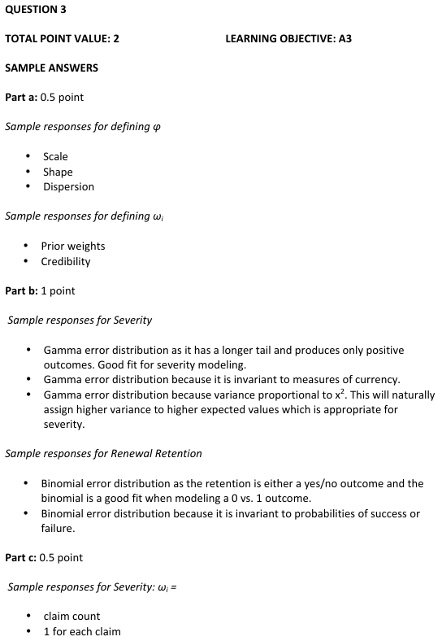
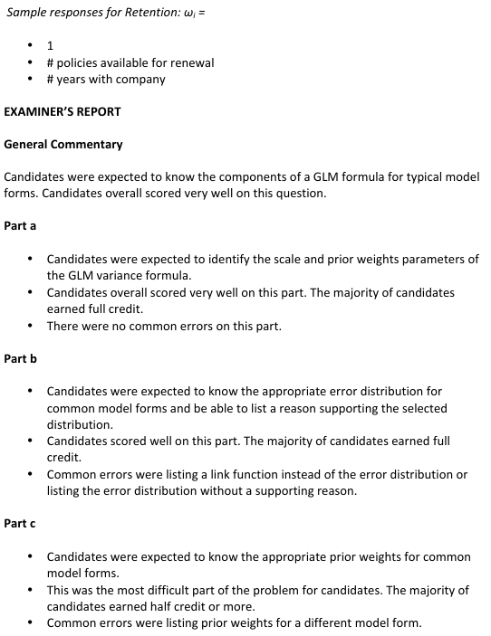

# 2014 Exam 8 - Q3

**Points:** 2

## Question

The random component of a generalized linear model must come from the exponential family of distributions.

The variance of a distribution from the exponential family can be expressed using the following formula:

### Part a (0.50 pts)

Define the parameters φ and ωi in the formula above.

### Part b (1.00 pts)

For each of the data sets below, identify the error distribution that should be used to model the data. Briefly explain why that error distribution is appropriate.

i. Severity

ii. Policy Renewal Retention

## Solution

### Part a

Phi is the dispersion parameter to scale the variance The omega's are the weights used to assign weights to each observation i

### Part b

i. The Gamma (or Inverse Gaussian) error distribution should be used for severity modeling

because: Any 1 of:

- It has a longer tail
- It only produces positive outcomes
- It will assign higher variance to observations with higher expected values.
- For Gamma only: It is invariant to measures of currency

ii. The Binomial error distribution should be used for Retention modeling because: Any 1 of:

- Retention is either a yes/no outcome and the binomial is a good fit when modeling a 0

vs 1 outcome.

- It is invariant to probabilities of success or failure.

### Part c

i. For severity, the weights should be claim counts (1 for each claim)

ii. For retention, the weights should be number of policies available for renewal (1 for each policy)

## Examiner Report

### Part c (0.50 pts)

For each of the error distributions in part (b) above, provide an example of how ωi should be assigned for the type of data being modeled.

Examiner report solutions and comments:

