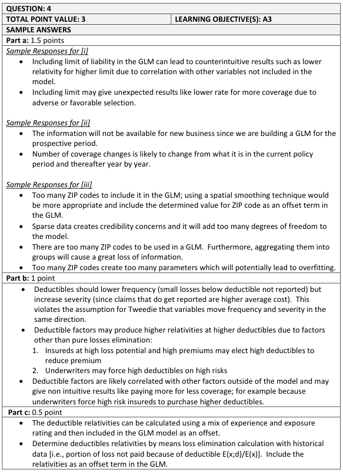
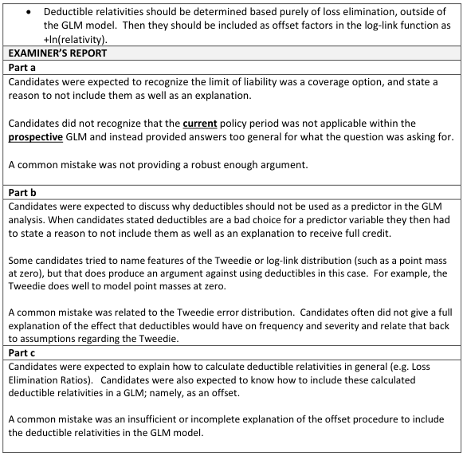

# 2016 Exam 8 - Q4

**Points:** 3

## Question

An actuary is conducting a generalized linear model (GLM) analysis on historical personal automobile data in order to develop a rating plan.

### Part a (1.50 pts)

Argue against the following factors being included as predictors in the actuary's GLM analysis:

i. Limit of Liability.

ii. Number of coverage changes during the current policy period.

iii. ZIP code of the garaging location of the automobile.

### Part b (1.00 pts)

The actuary is modeling pure premium with a log-link function and a Tweedie error distribution (1 < p < 2). Provide two arguments against the inclusion of deductible as a predictor in the actuary's GLM analysis.

### Part c (0.50 pts)

Other than including deductible as a predictor in the GLM, describe how to determine deductible relativities and how such relativities can be incorporated in a GLM.

## Solution

### Part a

i. Coverage related variables can give counterintuitive results in GLMs, such as having a

lower rate for a higher limit (can be due to selection effects), which would likely change insured behavior.

ii. I'm not fully sure I understand what the question writer expected here, as I see 2 issues, and neither

are really GLM specific issues. One issue is that insureds can potentially manipulate this variable. But the bigger issue I see, which I'll use in my answer, is a timing one: we don't know how many coverage changes the insured will make in the CURRENT policy, so how can we price it before the policy is even written?

While in hindsight we can see how many coverage changes have occurred during a policy period, when a new policy is written, we don't know how many changes it will have in that policy period. As such, we can't use this information to price policies as we won't have it at the time policies are written.

iii. Most ZIP codes on their own won't have enough data to be credible, so the model won't

give useful results. Furthermore, modeling each ZIP code separately can result in dramatic differences in rates between neighboring ZIP codes.

### Part b

This is seemingly redundant with limit of liability in part (a), so I'm not sure what they wanted here that would be different. I'll try not to overlap my answer here with what I'll use in part (c).

Reasons: any 2 of:

- Coverage related variables can give counterintuitive results in GLMs, such as having a

higher rate for a higher deductible (can be due to selection effects). This wouldn't make sense in practice.

- Deductibles can be correlated with variables outside the model, and as a result, the

deductible relativities will reflect values other than the pure loss elimination ratios. This can cause insureds to change their behavior, making the deductible relativities from the GLM no longer applicable.

- Higher deductibles should decrease frequency and increase severity net of the deductible.

This violates the Tweedie assumption that variables more frequency and severity in the same direction.

### Part c

Deductible relativities can be estimated using traditional loss elimination analysis, and then can be incorporated into GLMs using the offset term (equal to the log of the deductible relativity for that observation).

## Examiner Report

Examiner report solutions and comments:

