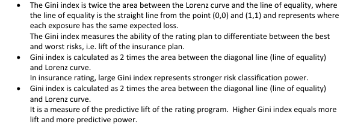
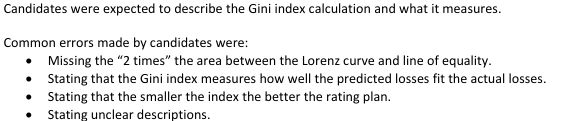

# 2016 Exam 8 - Q5 revised

**Points:** 0.5

## Question

Briefly describe how the Gini index is calculated and what the Gini index measures when applied to an insurance rating program.

## Solution

The Gini index would be calculated as the area between the line of equality and the Lorenz curve, multiplied by 2. The Gini index quantifies the ability of a model to identify the best and worst risks, with higher values being better.

## Examiner Report

Examiner report solutions and comments:

