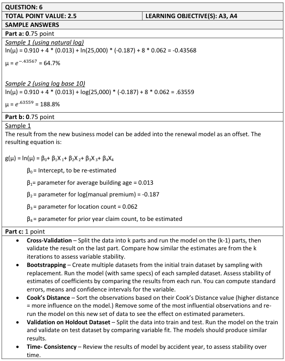
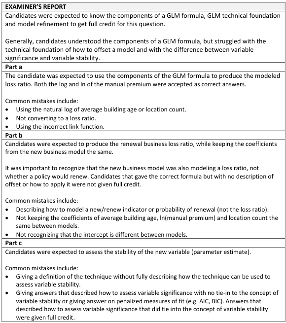

# 2016 Exam 8 - Q6

**Points:** 2.5

## Question

An actuary has constructed a three-variable Tweedie GLM with a log-link function to estimate loss ratios for commercial property new business. The actuary wants to create a second model for renewal business that will include all of the variables from the new business model, plus a variable for the prior year claim count. The actuary requires that the coefficients of the variables (Average Building Age, log(Manual Premium), and Location Count) are consistent between the new and renewal models. The fitted new business model parameters are as follows:

| Variable | Name | Estimate |
| --- | --- | --- |
|  | intercept | 0.910 |
| Average Building Age (Years) | age | 0.013 |
| log(Manual Premium) | logprem | -0.187 |
| Location Count | loccnt | 0.062 |

### Part a (0.75 pts)

Calculate the modeled loss ratio for a new business policy with a manual premium of $25,000, an average building age of four years, and having eight locations.

### Part b (0.75 pts)

Briefly describe how to produce the renewal business model, and specify the resulting equation for the renewal business modeled loss ratio.

### Part c (1.00 pts)

Identify and briefly describe two techniques that the actuary can use to assess the stability of the new variable in the renewal business model.

## Solution

### Part a

Note that the "log" for both the link function and Manual Premium will be the natural log. The model will be of the form:

ln LR = 0.910 + 0.013age - 0.187logprem + 0.062loccnt

**Predicted LR:** 64.68% — `=EXP(D12+4*D13+D14*LN(25000)+8*D15)`

### Part b

Note that I assume the intercept will be re-estimated, as that wasn't required to be the same between models. I also assume the answer here doesn't need to include things like "run the model using renewal data," as I believe the question was more focused on the renewal model equation itself. As far as the new claim count variable, I assume it will be a continuous variable rather than a categorical variable, but I think the graders will allow either interpretation. If you use it as a continuous variable, then I think you could either take the log of it or not.

The actuary can use the offset term in the renewal model to include the existing coefficients and values for the 3 variables from the new business model. This would allow the renewal GLM to have the same coefficients for these 3 variables as the new business model, and it would allow the GLM to then estimate a new coefficient for the additional claim count variable. The renewal model equation will be:

ln LR = Beta0 + 0.013age - 0.187logprem + 0.062loccnt + Beta1*ClaimCount

If you logged the new variable since it was continuous:

ln LR = Beta0 + 0.013age - 0.187logprem + 0.062loccnt + Beta1*ln(ClaimCount)

If you assumed the new variable was categorical (just 1 example, using 0 prior counts as the base level):

ln LR = Beta0 + 0.013age - 0.187logprem  + 0.062loccnt + Beta1*1Claim + Beta2*Morethan2Claims

### Part c

Not a well worded question, and as such, the intent is very unclear. The word "stability" is unusual here, as usually we use that term when talking about the model as a whole. If we were to interpret the question as asking how the addition of the new variable impacts the stability of the model as a whole, then we could look at things like correlation with other variables or we could check for multicollinearity issues using the Variance Inflation Factor. But if we instead were to interpret the question as asking only about the variable itself and not about the model, then really we are talking about the significance of the variable, and this can be measured using things like p-values or confidence intervals. Since the question focuses on the new variable, I don't think answers that relate to model stability but don't have anything to do with an individual variable would normally make sense here (things such as Cook's distance, cross-validation, or bootstrapping) - even though these are in the section of the source paper that focuses specifically on model stability. Given the poor wording, I think the CAS may accept any of these interpretations. My answers to this part assume the new variable will be continuous and not categorical.

SOLUTION 1: Assume the focus is on variable significance

- You can look at the p-value of the new variable to see if it is statistically significant. A very

small value (such as less than 0.05) will indicate the variable should be included in the model.

- You can look at the confidence interval around the beta coefficient of the new variable. If

the interval is very narrow, then the new variable should be included in the model.

SOLUTION 2: Assume the focus is on impact to model stability from adding new variable

- Check for high correlations between the new variable and existing variables in the model,

as these can result in model instability. If very high correlations do exist, you can remove the variable or use dimensionality reduction techniques to get new uncorrelated variables.

- Use the Variance Inflation Factor statistic to check for multicollinearity with other predictor

variables. VIF values of about 10 or greater indicate that multicollinearity is likely present in the model.

SOLUTION 3: Assume the focus is purely on model stability, not related to any variable Any 2 of:

- The impact of an individual record on the model can be measured using Cook's distance.

Records with the highest Cook's distance should be reviewed for possible removal from the dataset.

- Cross-validation can be used to assess model stability by comparing in-sample parameter

estimates across different model runs.

- Bootstrapping can be used to create new datasets by randomly sampling with replacement

from the original dataset. The model can then be refit on many different datasets, so we can get statistics like the mean and variance for each parameter estimate based on the different model runs.

- Run the model separately for several accident years of data, and see if the parameters are

consistent over time.

## Examiner Report

Examiner report solutions and comments:

