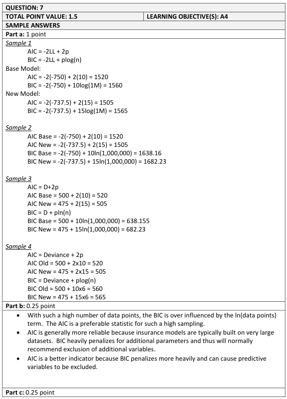
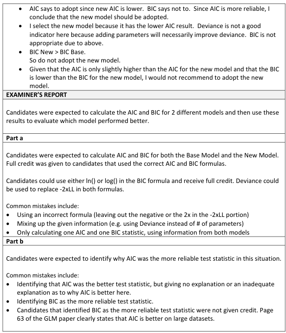

# 2016 Exam 8 - Q7

**Points:** 1.5

## Question

A company is considering modifying its rating plan to include factors by age group. Below are statistics for the base model and for the new model.

| Statistic | Base Model | New Model |
| --- | --- | --- |
| Loglikelihood | -750 | -737.5 |
| Scaled Deviance | 500 | 475 |
| Parameters | 10 | 15 |
| Data points | 1,000,000 | 1,000,000 |

### Part a (1.00 pts)

Calculate the Akaike Information Criterion (AIC) and the Bayesian Information Criterion (BIC) for both models.

### Part b (0.25 pts)

## Solution

### Part a

AIC = - 2 × ll + 2p. BIC = - 2 × ll + pln ( n )

|   | Base Model | New Model |
| --- | --- | --- |
| AIC | 1,520 | 1,505 |
| BIC | 1,638.155106 | 1,682.232658 |

Formulas

- `K5` = `=-2*D8+2*D10`
- `L5` = `=-2*E8+2*E10`
- `K6` = `=-2*D8+D10*LN(D11)`
- `L6` = `=-2*E8+E10*LN(E11)`

### Part b

The authors of the source paper favor AIC, as the BIC penalty for extra parameters can be large when the number of data points is large, as it is in many insurance datasets such as this one. That said, in theory, you should also be able to argue the merits of BIC (just not from any of the source material on this exam).

With larger datasets, the BIC penalty for extra parameters becomes very large, so AIC will be more reliable.

### Part c

Per (b), use AIC. Lower values of AIC are better. Thus, adopt the new model (1,505 < 1,520).

## Examiner Report

Explain whether AIC or BIC is a more reliable test statistic as an indicator of whether to adopt the new model.

### Part c (0.25 pts)

Recommend and briefly justify whether to adopt the new model.

Examiner report solutions and comments:

