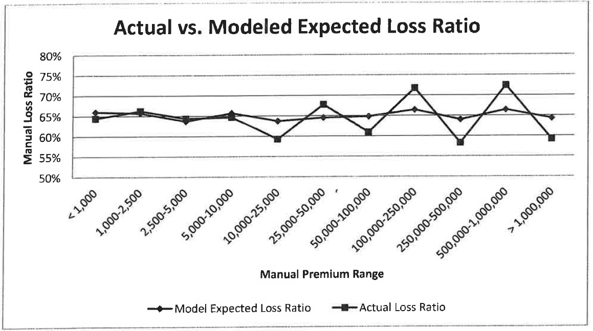
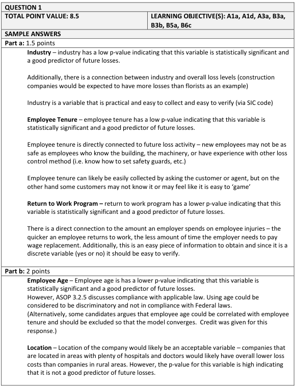
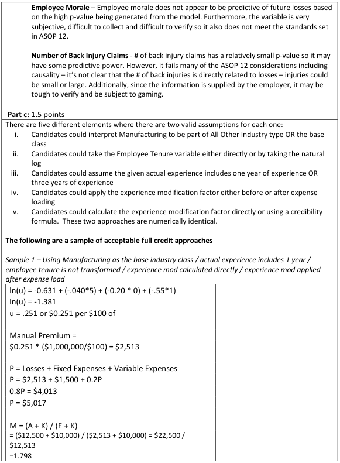
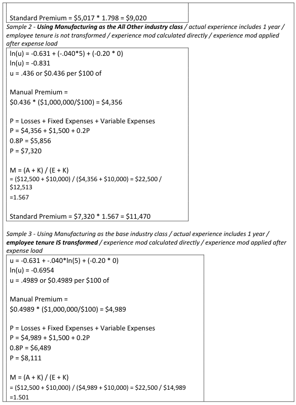
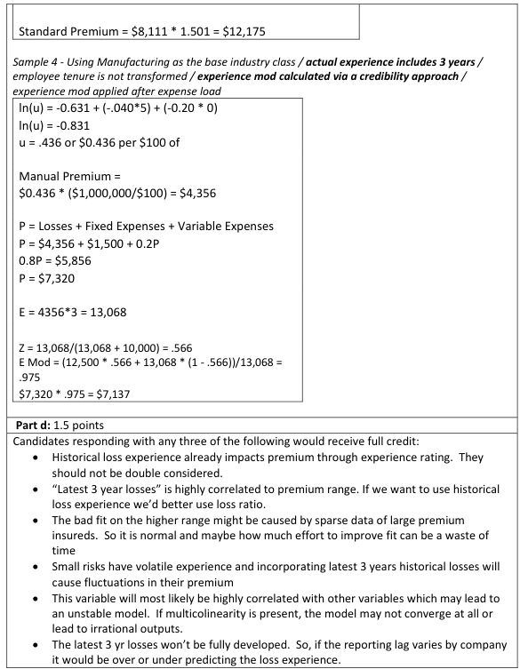
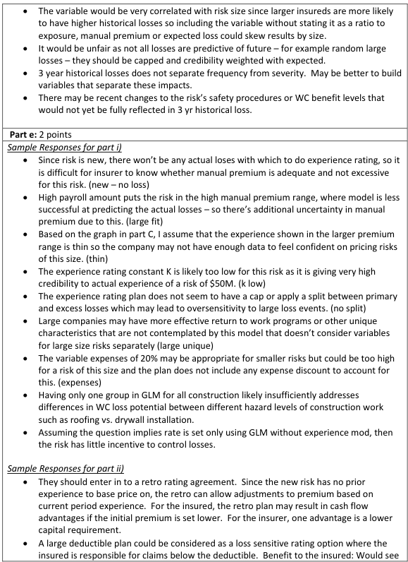
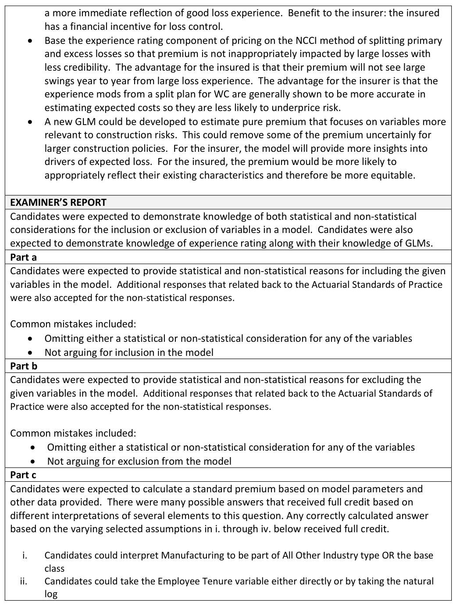
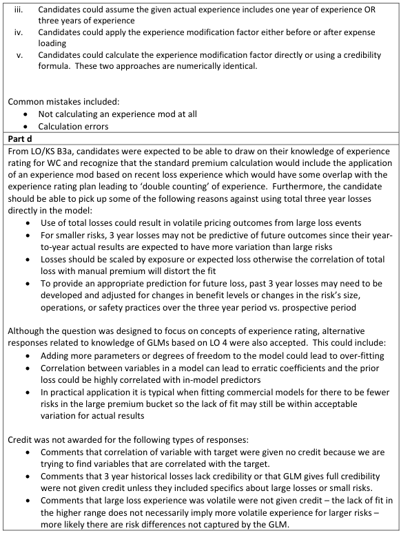
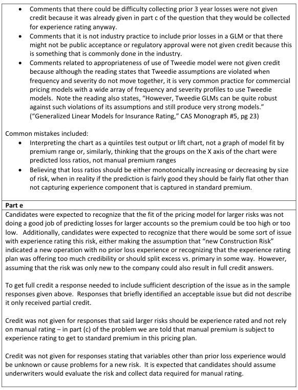

# 2017 Exam 8 - Q1

**Points:** 8.5

## Question

An actuary has constructed a pure premium model using the Tweedie distribution with parameter 1 < p < 2 to determine manual rates for a Workers' Compensation book of business. The output of the model is pure premium per $100 of payroll.

The following variables were considered for inclusion in the model:

| Variable | Description or Source of Data | p-value |
| --- | --- | --- |
| Industry | Construction, Manufacturing, All Other | 0.002 |
| Return to Work Program | Yes or No | 0.008 |
| Employee Age | Average Age in Years | 0.003 |
| Employee Tenure | Average Number of Years of Employment | 0.005 |
| Location | State of Jurisdiction | 0.080 |
| Employee Morale | Based on Results of Annual Company Survey | 0.150 |
| Number of Back Injuries | Supplied by Employer | 0.010 |

The actuary has decided to use the following variables in the model: Industry, Employee Tenure, and Return to Work Program.

### Part a (1.50 pts)

Discuss the statistical and non-statistical considerations of including each of the three variables (Industry, Employee Tenure and Return to Work Program) in the model.

### Part b (2.00 pts)

Discuss the statistical and non-statistical considerations of excluding each of the remaining four variables (Employee Age, Location, Employee Morale and Number of Back Injuries) from the model.

### Part c (1.50 pts)

The actuary fits the log link GLM model using the three selected variables. Given the fitted model parameters below and the following information for a Manufacturing Workers' Compensation risk, calculate the standard premium for this risk for an annual policy period.

| Parameter | Coefficient |
| --- | --- |
| Intercept | -0.631 |
| Employee Tenure | -0.040 |
| Return to Work Program: Yes | -0.200 |
| Industry Type: Construction | 0.350 |
| Industry Type: All Other | -0.550 |

| Data for Manufacturing Risk | Value |
| --- | --- |
| Payroll | $1,000,000 |
| Employee Tenure | 5 Years |
| Return to Work Program | No |
| Actual Losses for Experience Rating | $12,500 |
| Fixed Expenses | $1,500 |
| Variable Expenses (as % of premium) | 20% |
| Experience Rating Constant (K) | $10,000 |

### Part d (1.50 pts)

The actuary has graphed actual vs. modeled expected loss ratios by size of risk for the company's entire Workers' Compensation book, which is shown below.

In order to improve the model fit for larger risks, the actuary is considering incorporating the variable "Latest 3 Year Historical Losses" into the model. Explain three reasons against doing

### Part so

**Line chart, "Actual vs. Modeled Expected Loss Ratio".** Horizontal axis = Manual Premium Range, vertical axis = Manual Loss Ratio (50% to 80%). Two series, *Model Expected Loss Ratio* and *Actual Loss Ratio*:

| Manual premium range | Model expected | Actual |
| --- | --- | --- |
| < 1,000 | 66% | 64.5% |
| 1,000-2,500 | 65.5% | 66% |
| 2,500-5,000 | 64.5% | 64% |
| 5,000-10,000 | 66% | 65% |
| 10,000-25,000 | 64% | 59.5% |
| 25,000-50,000 | 65% | 68.5% |
| 50,000-100,000 | 65.5% | 61% |
| 100,000-250,000 | 67% | 72% |
| 250,000-500,000 | 64.5% | 59% |
| 500,000-1,000,000 | 67% | 73% |
| > 1,000,000 | 65% | 60% |

The model is flat near 65% throughout while actuals swing increasingly wildly as premium size grows.

### Part e (2.00 pts)

The actuary is now developing a quote for a new Construction risk with $50,000,000 of payroll using this rating plan.

### Part i

Describe two potential issues in developing a premium for this risk under this rating plan.

### Part ii

Provide an alternative rating approach for this risk and briefly discuss the advantages of this alternative for the insured as well as the insurance company.

## Solution

Side note: in practice, Workers' Compensation is usually priced using manual rates by class code, and then the resulting manual premium is adjusted for things like experience rating, schedule rating, and the premium discount. This problem suggests that Workers' Compensation could use a different rating algorithm in which there is a single base rate instead of a base rate by class code. That said, I don't think that impacts your ability to answer the questions at all.

### Part a

From a statistical perspective, we would want low p-values as those would indicate the variable is statistically significant. Note that this question is a bit flawed as p-values are coefficient-specific, so for example it wouldn't make sense to have a single p-value for all states if each state has its own coefficient in the model. From a non-statistical perspective, we want to think about ASOP 12 considerations and the implications of using these variables. The answers to this latter piece could vary, and I'll just list what comes to my mind as important considerations.

Industry: Very low p-value, so statistically significant at 99.8% level. It seems logically related to expected losses, objective, practical, and legal to use in pricing.

Employee Tenure: Very low p-value, so statistically significant at 99.5% level. Employee experience seems logically related to expected losses, but it would be challenging to use from a practical perspective since data would be needed on all employees of a company, and you would have to consider that employees start and leave the company during a year. Also, it would be less useful for new companies.

Return to Work Program: Very low p-value, so statistically significant at 99.2% level. It seems causally related to expected indemnity losses, though it would potentially be difficult to verify, and the success of the program could vary significantly between companies.

### Part b

Employee Age: From a statistical perspective, it seems like this should be included since it has a very low p-value of 0.003. However, it might be highly correlated with the included variable of employee tenure, and if so, then it would make sense to exclude this variable. Furthermore, it would be challenging to use from a practical perspective since data would be needed on all employees of a company, and you would have to consider that employees start and leave the company during a year.

Location: This is not as good of a variable from a statistical perspective with a p-value of 0.08. However, it definitely makes intuitive sense that expected losses would vary by geographic area since Workers' Compensation benefits and regulations can vary by state. So I would still recommend having some sort of state-based pricing.

Employee Morale: This has a high p-value of 0.15, so it is not a good variable from a statistical perspective. Furthermore, it isn't as obvious how morale would relate to expected losses, and the validity of these survey results might even be questionable depending on how they are collected. So I think excluding the variable is appropriate.

Number of Back Injuries: This has a low p-value of 0.01, so it is statistically significant. However, this variable might have significant overlap with experience rating, which is done outside of manual rating. As such, I would recommend excluding this variable.

### Part c

The model would be of the form:

Pure prem rate = exp(-0.631 - 0.04 Tenure - 0.2 ReturntoWork + 0.35 Construction - 0.55 AllOther)

**PP rate:** 0.435613 — `=EXP(D37+D38*5)`

**PP:** $4,356 — `=K53*(D44/100)`

**Manual Prem:** $7,320 — `=(K55+D48)/(1-D49)`

Now we need to calculate the experience mod so we can get standard premium. Since we are given actual losses A and experience rating constant K, we can use the formula Mod = ( A + K ) / ( E + K ) , which is also equivalent to having Z = E/ ( E + K ) and then using Mod = [ ZA + ( 1 - Z )( E )] /E. I presume E will be the pure premium based on the output of the model, because that's our only option. Since we are talking about Work Comp experience rating, I assume we are talking about 3 years of actual losses compared against 3 years of expected losses, so I'll multiply the expected losses by 3 before using them.

**Mod:** 0.98 — `=ROUND((D47+D50)/(K55*3+D50),2)`

**Standard Prem:** $7,174 — `=K66*K57`

### Part d

I think it is quite difficult to think of 3 good reasons here, and it isn't obvious how the graph provides much value. The graph shows groups of risks, and we don't even know how many risks are in each bucket to know how much we should even care about the graph results - they might just be random volatility for a small number of large risks. It seems like this question might be more about experience rating.

- The 3 year loss variable would have significant overlap with experience rating, which is

determine separately from the manual premium. Adding this variable to the model would end up double counting the loss experience.

- Using a single variable for loss experience that doesn't vary by risk size would implicitly

give the same credibility to experience for very small risks and very large risks, which doesn't seem to make sense. Experience rating already gives more credibility to the experience of larger risks.

- There's no guarantee that adding the historical loss variable would improve the fit on

larger risks. It might even cause us to overfit to the training data, which would make it less predictive when applied to future risks in practice.

### Part e

Another question that isn't obvious. I presume the focus of the question has more to do with the size of the risk and that it is a new risk rather than it being a Construction risk.

i. • Since the company is new, employees won't have any tenure and it likely won't yet

have a return to work program, and it also won't have experience for experience rating, so it would only be priced based on its industry (which would be very weak classification).

- Since the risk is large, the model may be less accurate based on the graph in part (d).

ii. I think either a Large Deductible plan or a Retro rating plan could make sense here. I'll go with the

retro plan since thus far this question has been more about pricing uncertainty, and retrospective rating is just a method of pricing (rather than changing coverage provided).

A retrospective rating plan would work well here. It would allow the premium to be based on the insured's actual losses during the policy term. This would benefit the insurer since they will be able to obtain a more accurate premium for the risk given that they don't have much data to use to classify the risk. This would benefit the insured because they would end up with lower premiums if they have good experience, and it would make the insurer more likely to write the policy.

## Examiner Report

Examiner report solutions and comments:

