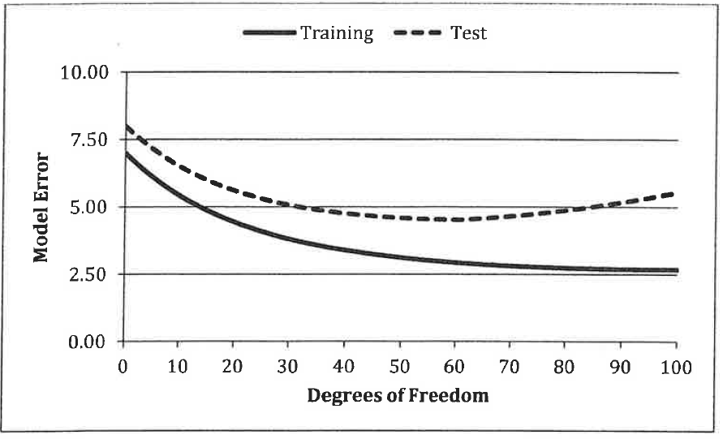
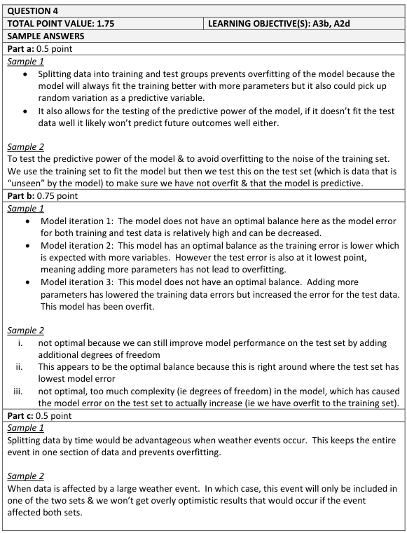
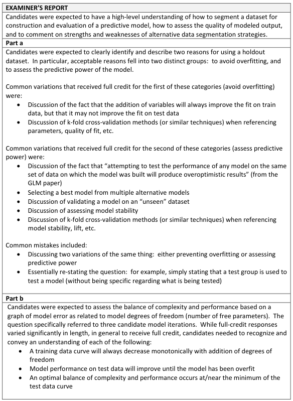
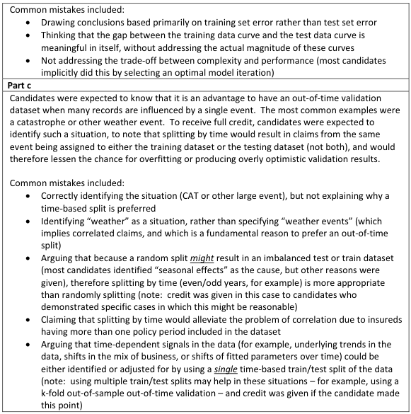

# 2017 Exam 8 - Q4

**Points:** 1.75

## Question

An actuary has split data into training and test groups for a model. The chart below shows the relationship between model performance and model complexity. Model performance is represented by model error and model complexity is represented by degrees of freedom.

## Solution

### Part a

- Having a separate test set allows you to see if you've overfit the model to the training data.
- Testing the model on a new dataset gives a measure of the predictive power of the model.

### Part b

The ideal point in the graph is the lowest model error for the test set, since the training set error will always get lower with more variables added, but that will cause overfit to the training data and will not generalize to other datasets.

i. At 10 df, the model can still be improved (underfit).

ii. At 60 df, the model has the optimal balance of complexity and performance.

iii. At 100 df, the model is overfit to the training data.

### Part c

Splitting by time is helpful when the same weather events would be in both datasets if split randomly, which could lead to over-optimistic validation results.

## Examiner Report

### Part a (0.50 pts)

Briefly describe two reasons for splitting modeling data into training and test groups.

### Part b (0.75 pts)

Briefly describe whether each of the following model iterations has an optimal balance of complexity and performance.

i. Model iteration 1: 10 degrees of freedom

ii. Model iteration 2: 60 degrees of freedom

iii. Model iteration 3: 100 degrees of freedom

### Part c (0.50 pts)

Identify and briefly describe one situation where it is an advantage to split the data by time rather than by random assignment.

Examiner report solutions and comments:

