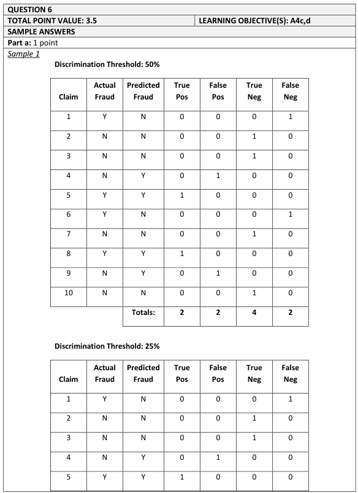
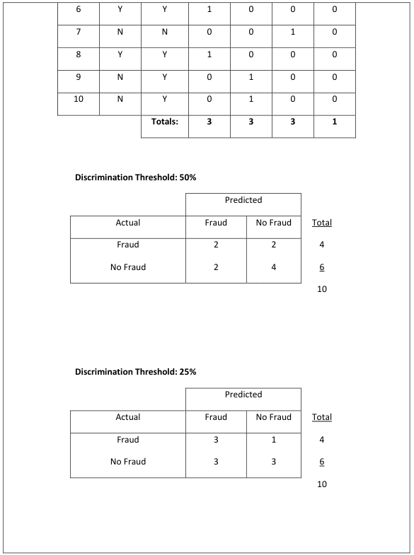
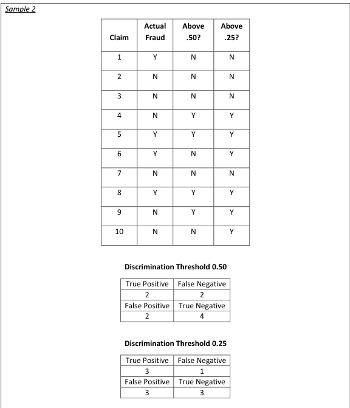
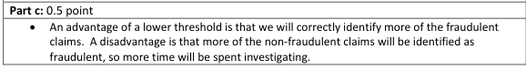
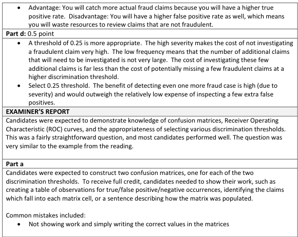
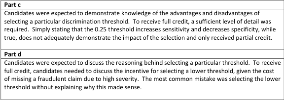

# 2017 Exam 8 - Q6 revised

**Points:** 2

## Question

A logistic model was built to predict the probability of a claim being fraudulent. Consider the predicted probabilities for the 10 claims below to be a representative sample of the total model.

| Claim Number | Actual Fraud Indicator | Predicted Probability of Fraud |
| --- | --- | --- |
| 1 | Y | 11% |
| 2 | N | 23% |
| 3 | N | 15% |
| 4 | N | 70% |
| 5 | Y | 91% |
| 6 | Y | 30% |
| 7 | N | 11% |
| 8 | Y | 75% |
| 9 | N | 58% |
| 10 | N | 27% |

### Part a (1.00 pts)

Construct confusion matrices for discrimination thresholds of 0.50 and 0.25.

### Part c (0.50 pts)

Describe an advantage and a disadvantage of selecting a discrimination threshold of 0.25 instead of 0.50.

### Part d (0.50 pts)

Describe whether a discrimination threshold of 0.25 of 0.50 is more appropriate for a line of business with low frequency and high severity.

## Solution

### Part a

0.5 threshold, predict fraud if prob ≥ 50%:

|   | Predicted |   |   |   | Predicted |   |
| --- | --- | --- | --- | --- | --- | --- |
| Actual | Fraud | No Fraud | Total | Actual | Fraud | No Fraud |
| Fraud | 2 | 2 | 4 | Fraud | True positives | False negatives |
| No Fraud | 2 | 4 | 6 | No Fraud | False positives | True negatives |
| Total | 4 | 6 | 10 |  |  |  |

Formulas

- `K6` = `=COUNT(E12,E15)`
- `L6` = `=COUNT(E8,E13)`
- `M6` = `=SUM(K6:L6)`
- `K7` = `=COUNT(E11,E16)`
- `L7` = `=COUNT(E9,E10,E14,E17)`
- `M7` = `=SUM(K7:L7)`
- `K8` = `=SUM(K6:K7)`
- `L8` = `=SUM(L6:L7)`
- `M8` = `=SUM(K8:L8)`

0.25 threshold, predict fraud if prob ≥ 25%:

Predicted

| Actual | Fraud | No Fraud | Total |
| --- | --- | --- | --- |
| Fraud | 3 | 1 | 4 |
| No Fraud | 3 | 3 | 6 |
| Total | 6 | 4 | 10 |

Formulas

- `K14` = `=COUNT(E12,E13,E15)`
- `L14` = `=COUNT(E8)`
- `M14` = `=SUM(K14:L14)`
- `K15` = `=COUNT(E11,E16,E17)`
- `L15` = `=COUNT(E9,E10,E14)`
- `M15` = `=SUM(K15:L15)`
- `K16` = `=SUM(K14:K15)`
- `L16` = `=SUM(L14:L15)`
- `M16` = `=SUM(K16:L16)`

### Part c

Advantage of 0.25 threshold: correctly predict fraud more often (more true positives) Disadvantage of 0.25 threshold: Incorrectly predict fraud more often (more false positives)

You could have also said an advantage was fewer false negatives and a disadvantage was fewer true negatives.

### Part d

With high severity, the consequences of being able to deny a claim that is fraudulent are more significant, and with lower frequency, there are fewer claims that would potentially need to be investigated. As such, a lower discrimination threshold seems more appropriate to catch fraud more often without too many investigations being conducted.

## Examiner Report

Examiner report solutions and comments:

