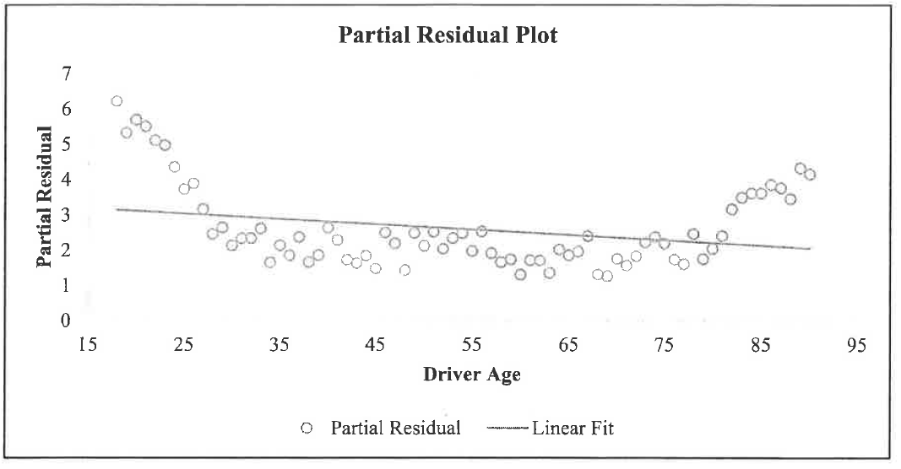
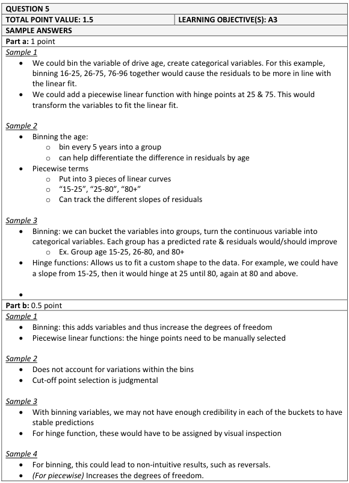
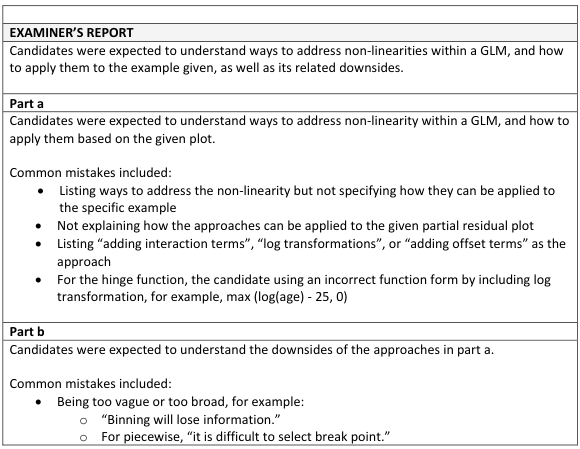

# 2018 Exam 8 - Q5

**Points:** 1.5

## Question

An actuary is analyzing a partial residual plot of the driver age variable, which is shown below:

## Solution

### Part a

Note: Natural cubic splines would also be a valid answer here, but at the time this question was asked, they weren't on the exam syllabus. Also, they aren't really covered in much detail on the syllabus, so students likely wouldn't be required to describe in any detail how they would work in this example.

- Binning could be used to turn driver age into a categorical variable with separate bins. In

this example, bins could be created for ages below 25, ages 25-80, and ages 81+.

- Piecewise linear functions (hinge functions) of the form max(0,xj - c) could be added at

each break point c. In this example, hinge functions could allow us to fit a line with a negative slope for ages below 25, a relatively flat line for ages between 25 and 80, and a line with a positive slope for ages above 80.

### Part b

A downside to binning is: any 1 of:

- it increases the degrees of freedom of the model
- it can result in inconsistent or impractical patterns
- that variation within bins are ignored

A downside to hinge functions is: any 1 of:

- break points must be chosen manually
- it increases the degrees of freedom of the model

## Examiner Report

### Part a (1.00 pts)

Adding polynomial terms is one approach to address the non-linearity in the driver age variable.

Briefly describe two other alternative approaches and how they can be used to improve the fit of the driver age variable shown above.

### Part b (0.50 pts)

Briefly describe a downside to each of the two alternative approaches recommended in part (a) above.

Examiner report solutions and comments:

