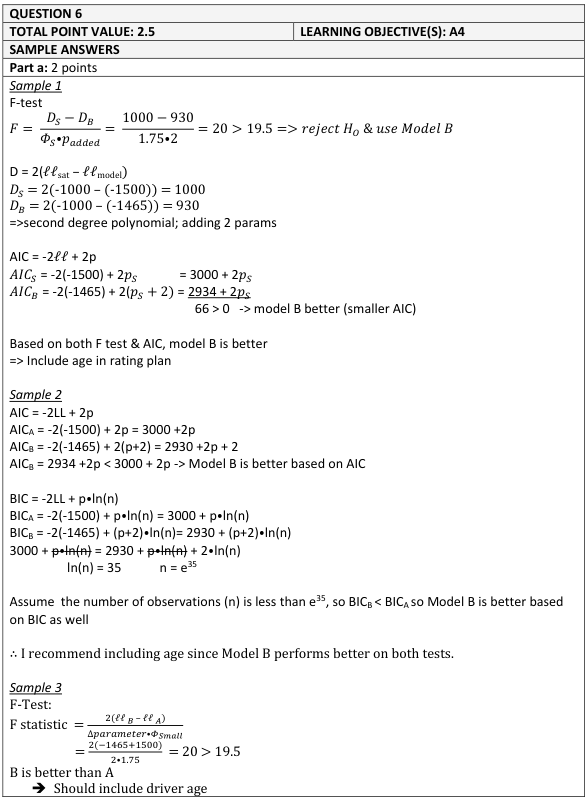
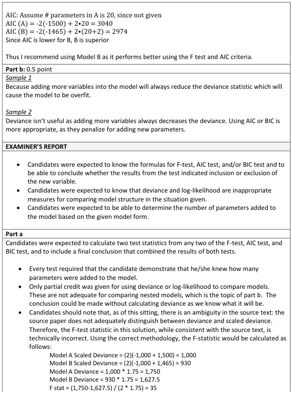
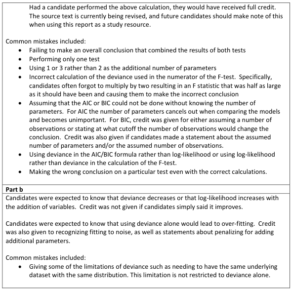

# 2018 Exam 8 - Q6

**Points:** 2.5

## Question

An actuary is comparing the output of two generalized linear models to develop a new rating plan for personal auto. Model statistics are shown below:

|   | Saturated Model | Model A | Model B |
| --- | --- | --- | --- |
| Log-Likelihood | -1,000 | -1,500 | -1,465 |
| Estimated Dispersion Parameter | 1.75 | 1.75 | 1.75 |

- Model A is a nested model of Model B, where Model B has an additional variable for driver age.
- Driver age is fit using a second-order polynomial.

19.5 — The critical value to be used from the F-distribution

### Part a (2.00 pts)

Using two statistical tests, recommend whether or not driver age should be included in the rating plan.

### Part b (0.50 pts)

Describe why the deviance statistic alone should not be used to assess model fit.

## Solution

### Part a

From the source text, we really have 3 options here: the F-test, comparing AIC, and comparing BIC. Only the F-test is designed for nested models, though AIC and BIC can also be used for nested models. The source text says BIC is less reliable for insurance data, so I'll just use the F-test and AIC in my answer (though BIC should have also been accepted). Note that since driver age is fit using a second-order polynomial, it adds 2 additional parameters to the model.

Model A AIC = (-2)(-1500) + 2p = 3,000 + 2p Model B AIC = (-2)(-1465) + 2(p + 2) = 2,934 + 2p

Since p > 0, and a lower AIC is better, Model B is better and suggests driver age should be added to the rating plan.

| J | L |
| --- | --- |
| Model A Scaled Deviance | 1,000 |
| Model B Scaled Deviance | 930 |

Formulas

- `L14` = `=2*(D8-E8)`
- `L15` = `=2*(D8-F8)`

| J | L |
| --- | --- |
| Model A Unscaled Deviance | 1,750 |
| Model B Unscaled Deviance | 1,627.5 |

Formulas

- `L17` = `=L14*E9`
- `L18` = `=L15*F9`

**F statistic:** 35 — `=(L17-L18)/(2*F9)`

Since 35 > 19.5, Model B is better, and driver age should be included in the rating plan.

### Part b

Since adding more variables to a model always reduces deviance (as there is more freedom to fit the data), it is difficult to tell whether a model with lower deviance is lower because it is a superior model or lower because it has more variables in the model, even if those variables aren't predictive. As such, comparing deviances between 2 models in isolation provides an insufficient comparison.

## Examiner Report

Examiner report solutions and comments:

Note: the solutions shown for part (a) incorrectly calculate the F-statistic. This is discussed in the commentary later.

