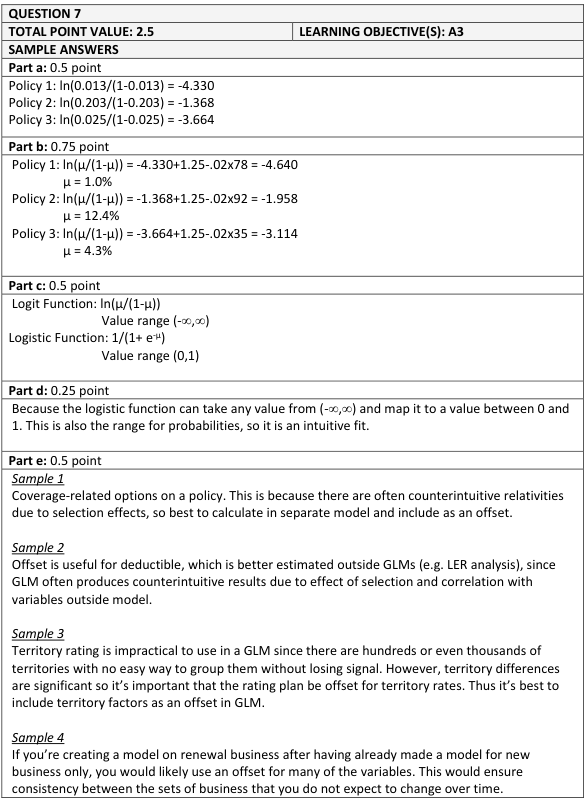
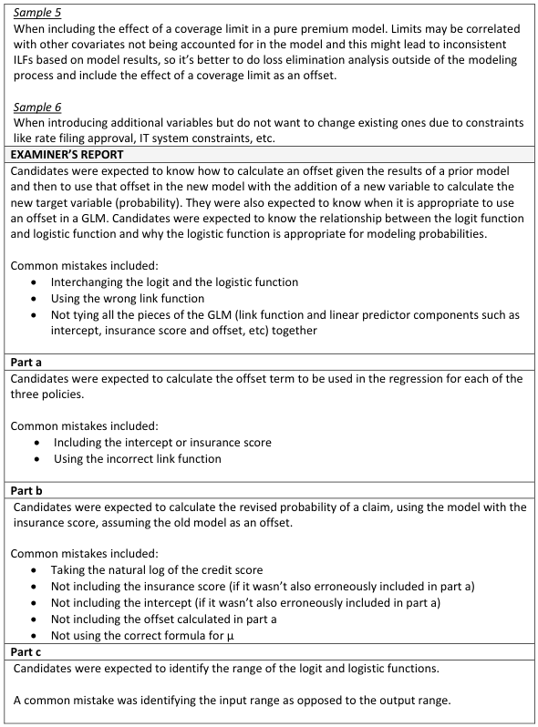
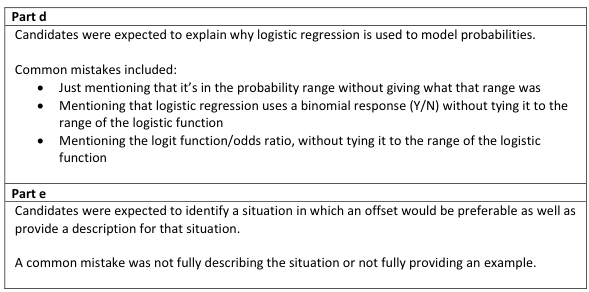

# 2018 Exam 8 - Q7

**Points:** 2.5

## Question

An actuary is planning to add a credit-based insurance score to a model that estimates the probability of a policy having a claim. The actuary has decided to offset all of the current model variables before fitting the new variable.

Given the following:

- The current model (without the insurance score variable) is a logit-link binomial GLM (logistic

regression).

- The logit link function is defined as
- The insurance score is a continuous variable having a value between 1 and 100.
- The current fitted values and insurance score for three policies as well as regression results from

the fit of the insurance score variable are given below:

| Policy Number | Fitted Probability Without Insurance Score | Insurance Score |
| --- | --- | --- |
| 1 | 1.3% | 78 |
| 2 | 20.3% | 92 |
| 3 | 2.5% | 35 |

| Variable | Parameter Estimate |
| --- | --- |
| Intercept | 1.250 |
| Insurance Score | -0.020 |

### Part a (0.50 pts)

Calculate the offset term to be used in the regression for each of the three policies above.

### Part b (0.75 pts)

Calculate the revised fitted probability of having a claim for each of the three policies above.

### Part c (0.50 pts)

Identify the range of:

i. the logit function

ii. the logistic function

### Part d (0.25 pts)

Briefly explain why logistic regression is often used to model probabilities.

## Solution

### Part a

I assume the model is modeling the probability of a policy having AT LEAST 1 claim. The source text doesn't get into the calculation of offset terms other than mentioning that they need to be on the same scale as the linear predictor. Also, it is very unusual to see an offset term used in logistic regression. Even the example in this problem doesn't seem to be a good reason to use the offset, as we'd likely want to know how including credit changes the predictive value of other variables that might be correlated with credit. By far, the more common use of offset terms by actuaries would be incorporating things like territory factors, deductible factors, or increased limit factors into a pure premium (log-link) GLM.

I assume the "fitted probability without insurance score" would include any prior intercept term from this old model as part of the offset. Normally, an old intercept term wouldn't be part of the offset term, but since we are given the full old fitted probabilities and not just the betas and X's for certain variables, I would presume the old intercept term would have to be included as part of this offset.

| Policy | Offset |
| --- | --- |
| 1 | -4.330 |
| 2 | -1.368 |
| 3 | -3.664 |

Formulas

- `K17` = `=LN(D19/(1-D19))`
- `K18` = `=LN(D20/(1-D20))`
- `K19` = `=LN(D21/(1-D21))`

### Part b

I assume insurance score isn't logged since it isn't mentioned in the question.

| Policy | g(mu) | Probability |
| --- | --- | --- |
| 1 | -4.640 | 1.0% |
| 2 | -1.958 | 12.4% |
| 3 | -3.114 | 4.3% |

Formulas

- `K24` = `=$D$24+$D$25*E19+K17`
- `L24` = `=1/(1+EXP(-K24))`
- `K25` = `=$D$24+$D$25*E20+K18`
- `L25` = `=1/(1+EXP(-K25))`
- `K26` = `=$D$24+$D$25*E21+K19`
- `L26` = `=1/(1+EXP(-K26))`

### Part c

i. The logit function outputs a range from -infinity to +infinity

ii. The logistic function outputs a range from 0 to 1

### Part d

Because it uses a binomial error distribution (appropriate for probabilities) and the logistic function maps an unbound linear predictor to the [0,1] range appropriate for estimating probabilities.

### Part e

I mentioned several examples in my earlier comments in part (a), so I'll just show 1 example here.

Deductible relativities obtained from a loss elimination analysis could be added as offsets in a pure premium GLM.

## Examiner Report

### Part e (0.50 pts)

Identify and briefly describe one situation in which the use of an offset is preferable to (re)fitting all variables.

Examiner report solution and comments:

