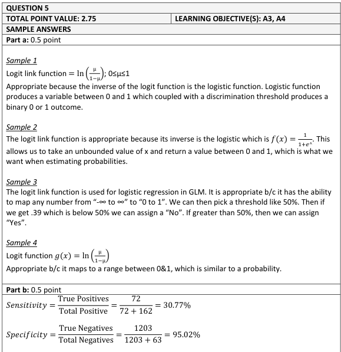
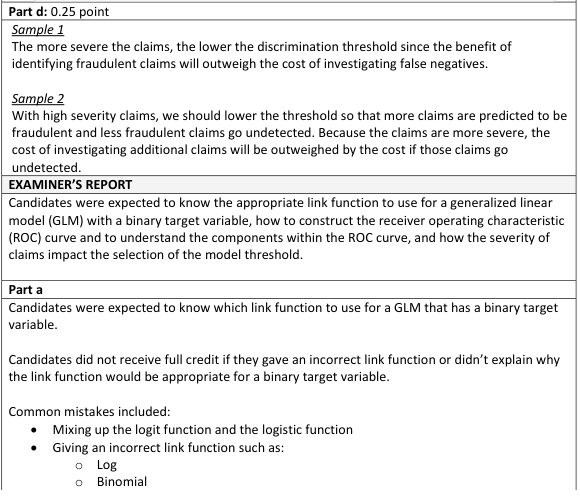
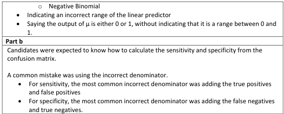
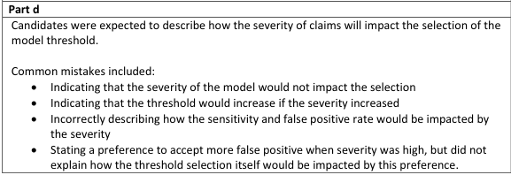

# 2019 Exam 8 - Q5 revised

**Points:** 1.25

## Question

The following confusion matrix shows the result from a claim fraud model with a discrimination threshold of 25%:

Predicted

| Actual | Yes | No |
| --- | --- | --- |
| Yes | 72 | 162 |
| No | 63 | 1,203 |

### Part a (0.50 pts)

Identify a link function that can be used for a generalized linear model that has a binary target variable and briefly explain why this link function is appropriate.

### Part b (0.50 pts)

Calculate the sensitivity and specificity from the above data.

### Part d (0.25 pts)

Briefly describe how the severity of claims will impact the selection of the model threshold.

## Solution

### Part a

The logit link function is best to use as its inverse (the logistic function) transforms the linear predictor to a [0,1] range that is appropriate for a binary target variable.

### Part b

| B | C |
| --- | --- |
| Sensitivity | 30.8% |
| Specificity | 95.0% |

Formulas

- `C26` = `=D9/(D9+E9)`
- `C27` = `=E10/(D10+E10)`

### Part d

With higher severity of fraud, it will be cost effective to spend more on investigating fraud, which means choosing a lower discrimination threshold to catch more potential fraud.

## Examiner Report

Examiner report solutions and comments:

