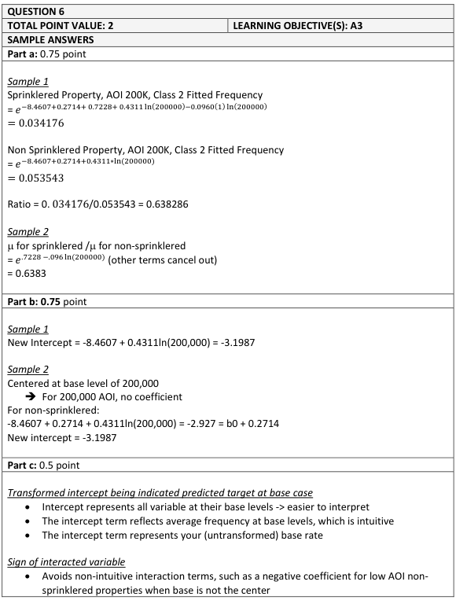
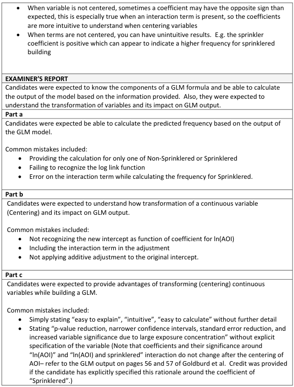
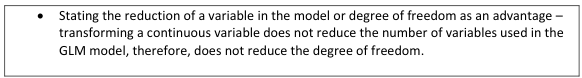

# 2019 Exam 8 - Q6

**Points:** 2

## Question

An actuary creates a generalized linear model (GLM) to estimate commercial property claim frequency by occupancy class and amount of insurance (AOI) for sprinklered and non-sprinklered risks. Given the following:

- Occupancy class is a categorical variable with four levels: class 1, 2, 3, and 4.
- Sprinklered status is a categorical variable with two levels: sprinklered and non-sprinklered.
- The natural log of AOI, ln(AOI), is a continuous variable.
- The log link function is selected.
- An interaction variable is included as ln(AOI) for sprinklered and zero otherwise.
- The model results are as follows:

| Parameter | Coefficient |
| --- | --- |
| Intercept | -8.4607 |
| Occupancy class 2 | 0.2714 |
| Occupancy class 3 | 0.3620 |
| Occupancy class 4 | 0.0395 |
| Sprinklered | 0.7228 |
| ln(AOI) | 0.4311 |
| Sprinklered:Yes, ln(AOI) | -0.0960 |

### Part a (0.75 pts)

Calculate the ratio of the estimated model frequency of a sprinklered property to that of a non-sprinklered property for the following characteristics:

| B | C |
| --- | --- |
| 200,000 | AOI |
| 2 | Occupancy class |

### Part b (0.75 pts)

Calculate the intercept term if AOI is centered at the base level of 200,000.

### Part c (0.50 pts)

Briefly describe two advantages of centering variables of a GLM at their base levels.

## Solution

### Part a

Occupancy class 1 and non-sprinklered risks are part of the base levels in the intercept term. The equation is:

ln(mu) = β0 + β1 Occ2 + β2 Occ3 + β3 Occ4 + β4 Sprinklered + β5 ln(AOI) + β6 Sprinklered × ln(AOI)

| J | K |
| --- | --- |
| Sprinklered | 0.034 |
| Non-Sprinklered | 0.054 |

Formulas

- `K7` = `=EXP(D16+D17+D20+LN(B28)*D21+LN(B28)*D22)`
- `K8` = `=EXP(D16+D17+LN(B28)*D21)`

**Ratio:** 0.638 — `=K7/K8`

### Part b

The new re-based equation will be:

ln(mu) = β0 + β1 Occ2 + β2 Occ3 + β3 Occ4 + β4 Sprinklered + β5 ln(AOI/200k) + β6 Sprinklered × ln(AOI/200k)

Compared to the original model, only the β0 and β4 coefficients will change. For this solution, we only need to figure out the new intercept term β0 , which turns out to be fairly straightforward and makes the point value for this problem unusually high. A good way to check that you've done this right is to check that the new equation results in the exact same predictions as the original equation for the non-sprinklered case.

**New intercept:** -3.1987 — `=D16+LN(B28)*D21`

We can check this by re-calculating the non-sprinklered prediction from part (a):

| J | K | L |
| --- | --- | --- |
| Base | 0.041 |  |
| Occ2 Rel | 1.312 |  |
| ln(AOI) Rel | 1.000 |  |
| Prediction | 0.054 | unchanged from part (a) |

Formulas

- `K26` = `=EXP(K22)`
- `K27` = `=EXP(D17)`
- `K28` = `=EXP((D21*LN(B28/B28)))`
- `K29` = `=PRODUCT(K26:K28)`

While not needed for this problem, the new sprinkler coefficient can be calculated as:

**Beta4:** -0.449 — `=D20+(D16+D21*LN(B28)+D22*LN(B28))-(K22+D21*LN(B28/B28)+D22*LN(B28/B28))`

### Part c

Any 2 of:

- The intercept term becomes more intuitive as the average frequency at base levels.
- This avoids counter-intuitive signs (positive/negative) of coefficients when interaction

terms are present.

- The p-values for variable significance for the Sprinklered variable will be lower (i.e., tighter

confidence intervals) when variables are at the base level. Note: credit was not given if this p-value reduction was discussed generally or for the other variables in the model.

## Examiner Report

Examiner report solutions and comments:

