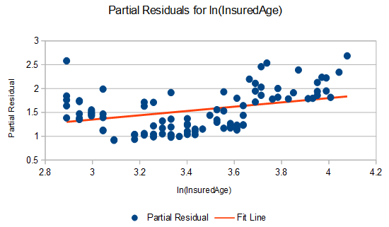

# Practice Problem 15

## Question

You are creating a GLM to model claim severity with 3 variables - Gender, Territory, and Insured Age - with the GLM equation estimated as follows:

ln(μ) = 5.80 + 0.76Male + 1.27TerritoryA + 0.45ln(InsuredAge)

- Gender only has values of Female and Male.
- Territory only has values of A and B.
- Insured Age is a continuous variable.

### Part a

Calculate the partial residual for the Insured Age variable for a 40 year old male in territory A with an actual claim severity of $2,000.

### Part b

You are given the following graph of partial residuals for the ln(InsuredAge) variable:

**Scatter plot titled "Partial Residuals for ln(InsuredAge)".** Horizontal axis = ln(InsuredAge) from 2.8 to 4.2, vertical axis = Partial Residual from 0.5 to 3. Points scatter between about 0.9 and 2.7, and a straight red *Fit Line* rises steadily from roughly 1.35 at ln(age) = 2.8 to about 1.85 at ln(age) = 4.1. The points dip below the line around ln(age) 3.1-3.4 and sit above it beyond 3.7, hinting the linear term does not capture the true curvature.

Based on the graph, make a suggestion as to how the ln(InsuredAge) variable can be transformed to better fit the data.

### Part c

Briefly describe one downside to your suggestion from part (b) above.

## Solution

### Part a

| J | K |
| --- | --- |
| mu_i | $13,227 |
| Partial residual | 0.811 |

Formulas

- `K2` = `=EXP(5.8+0.76+1.27+0.45*LN(40))`
- `K3` = `=(2000-K2)/K2+0.45*LN(40)`

### Part b

Natural cubic splines would also be an acceptable answer here, though the details of how they would work aren't discussed on the syllabus.

Any 1 of:

- You could transform the ln(InsuredAge) variable into a categorical variable. Based on the

graph, it seems like reasonable buckets might be from values of 2.8 to 3, from 3 to 3.6, and from 3.7 to 4.2. This would look like a flat line over each of these ranges, and would better fit the partial residuals.

- You could add polynomial terms for ln(InsuredAge). Based on the graph, adding a term for

ln(InsuredAge)^2 would help with the parabolic nature of the points, and adding a second term for ln(InsuredAge)^3 could help the fit since the slope of the points on the right side of the graph seems flatter than on the left side of the graph.

- You could add piecewise linear functions of ln(InsuredAge). Based on the graph, it seems

like a line with a negative slope could be a good fit between values of 2.8 to 3.2, a line with a slightly positive slope could be a good fit between values of 3.2 and 3.6, a steep line could fit between 3.6 and 3.8, and another line with a slightly positive slope could fit between 3.8 and 4.2. These lines could be created with hinge functions of the form max(0,ln(InsuredAge) - c) at each break point c.

### Part c

Corresponding with the answers in part (b):

- Any 1 of:

◦ This increases the degrees of freedom in the model. ◦ This can result in inconsistent or unreasonable patterns. ◦ Variation within each bin is ignored.

- Adding polynomial terms makes the coefficients harder to interpret without a graph.
- Break points for the hinge functions must be chosen manually.
