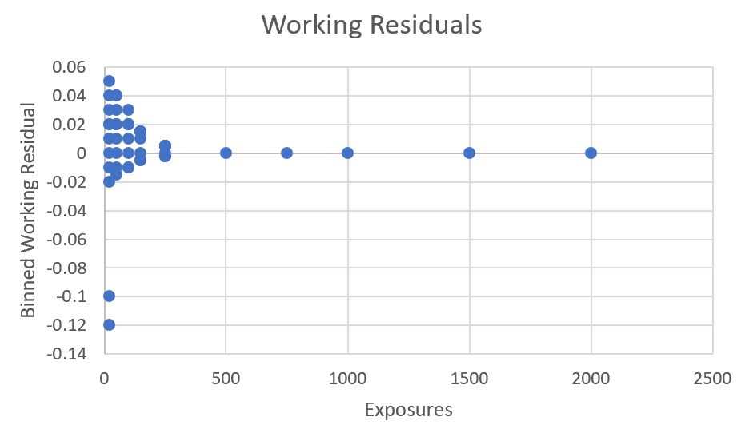

# Practice Problem 22

## Question

You have created a GLM to model pure premium. You calculate and plot the binned working residuals against exposures, resulting in the following graph:

**Scatter plot titled "Working Residuals".** Horizontal axis = Exposures (0 to 2,500), vertical axis = Binned Working Residual (-0.14 to 0.06). Residuals fan out widely at low exposure counts (spread roughly -0.02 to +0.05, with two outliers at -0.10 and -0.12 near zero exposures) and collapse to essentially zero for bins with 500 or more exposures — the classic funnel showing variance decreasing as exposure grows.

Briefly describe what might be causing the pattern above, and suggest an improvement to the model.

## Solution

There is greater variance observed for low exposures, and the model may not be taking the expected lower variance into account for higher exposures. To improve this, I would suggest adding exposures as weights in the model.
