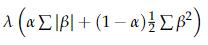

# Practice Problem 23

## Question

You are given the following for an elastic net:

| B | C |
| --- | --- |
| 5.80 | Intercept term |
| 0.76 | Coefficient of Male variable, centered and scaled |
| -1.27 | Coefficient of Territory A variable, centered and scaled |
| 0.45 | Coefficient of ln(Insured Age) variable, centered and scaled |

| B | C |
| --- | --- |
| 0.5 | alpha parameter for elastic net |
| 2 | lambda parameter for elastic net |

Calculate the penalty applied by the elastic net.

## Solution

Elastic-net penalty:

$$\lambda\left(\alpha\sum|\beta| + (1-\alpha)\tfrac{1}{2}\sum\beta^2\right)$$

The penalty is given by:

Note that we don't include the intercept term in this, so we should just ignore it.

**Sum(absolute value(betas)):** 2.48 — `={SUM(ABS(B7:B9))}`

**Sum(betas^2):** 2.393 — `=SUMSQ(B7:B9)`

**Penalty:** 3.6765 — `=B12*(B11*D21+(1-B11)*D23/2)`
