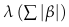
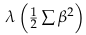

# Practice Problem 3

## Question

You are given the following data for lasso and ridge penalized models for an insurer:

| Variable | Lasso Coefficient | Ridge Coefficient |
| --- | --- | --- |
| Intercept | 5.80 | 5.95 |
| Male | 0.00 | 0.22 |
| Territory A | -1.27 | -1.38 |
| ln(Insured Age) | 0.45 | 0.51 |

- All predictor variables have been standardized to have a mean of 0 and a standard deviation of 1.
- The insured sex variable has values of Male and Female. Female is the base level.
- The territory variable has values of A and B. B is the base level.
- The natural log of the insured age is a continuous variable.

| B | C |
| --- | --- |
| 2.00 | lambda parameter for lasso penalty |
| 0.70 | lambda parameter for ridge penalty |

### Part a

Calculate the penalty term for the lasso model.

### Part b

Calculate the penalty term for the ridge model.

### Part c

Will the deviance term be the same for the lasso and ridge models? Why or why not?

## Solution

### Part a

Remember that we don't include the intercept term in the penalty calculation.

Lasso ($L_1$) penalty:

$$\lambda\left(\sum|\beta|\right)$$

Lasso penalty formula:

**Lasso penalty term:** 3.44 — `={B16*SUM(ABS(C7:C9))}`

Ridge ($L_2$) penalty:

$$\lambda\left(\tfrac{1}{2}\sum\beta^2\right)$$

### Part b

Ridge penalty formula:

**Ridge penalty term:** 0.77 — `=0.5*B17*SUMSQ(D7:D9)`

### Part c

The deviance term will not be the same between the 2 models since they have different coefficients.

This is in addition to the penalty not being the same as shown above.
