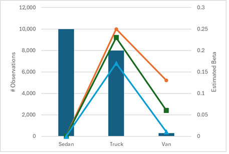

# Practice Problem 5

## Question

The image below shows estimated relativities for a vehicle type variable from 3 different models:

1. A standard GLM

2. A lasso model with a low penalty term

3. A ridge model with a large penalty term

**Combined chart: observations and estimated beta by vehicle type.** Left axis = # Observations (0 to 12,000), right axis = Estimated Beta (0 to 0.3), categories Sedan / Truck / Van. Bars show observation counts; three lines show estimated betas from different fits.

| Vehicle | Observations | Beta (line 1) | Beta (line 2) | Beta (line 3) |
| --- | --- | --- | --- | --- |
| Sedan | 10,000 | 0 (base) | 0 | 0 |
| Truck | 8,000 | 0.25 | 0.23 | 0.17 |
| Van | ~300 | 0.13 | 0.06 | 0.005 |

Sedan is the base level. The three fits agree closely for Truck (high volume) but diverge sharply for Van, which has very few observations.

Explain which of each the 3 curves in the image correspond with each of the 3 models above. Explain your reasoning.

## Solution

While one of the models is a lasso model and the other is a ridge model, that really makes no difference as it relates to this graph. The focus is just that these are both penalized models, which will pull the coefficients closer to 0.

Penalized models like lasso and ridge will generally pull the estimated coefficients closer to 0. The higher the penalty, the closer to 0 the coefficient will be pulled. As such:

The orange curve (with circle markers) represents the standard GLM (furthest from 0). The green curve (with square markers) represents the (lasso) model with the low penalty. The light blue curve (with triangle markers) represents the (ridge) model with the high penalty.
