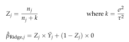
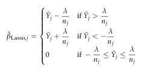

# Practice Problem 15

## Question

An actuary is modeling claim severity deviations from the grand average for a specific, high-risk class of business, "Class X". The model assumes a Normal distribution for the data and uses an identity link function. The only predictor variable in the model is the class of business.

Given:

| B | C |
| --- | --- |
| 500 | Number of observations for class X |
| 600 | Observed average severity deviation for class X from the grand average |
| 4,500,000 | Variance of target variable in the model |
| 5,000 | Variance for the prior distribution assumed for model coefficients |

### Part a

Calculate the estimated coefficient for class X using a standard Generalized Linear Model.

### Part b

Calculate the estimated coefficient for class X using a Ridge penalized regression model.

### Part c

Calculate the estimated coefficient for class X using a Lasso penalized regression model. Assume the penalty parameter is:

350,000 — Penalty parameter for lasso regression model

### Part d

Explain the differences in the answers for parts (a) through (c) above.

## Solution

### Part a

With just 1 variable, GLMs will predict the sample average for each class.

**Beta_X,GLM:** 600 — `=B10`

### Part b

The Ridge estimate will be equal to the Buhlmann credibility estimate in this case.

| K | L | M |
| --- | --- | --- |
| k | 900 | this also equals the penalty parameter for Ridge in this case |
| Z | 0.357143 |  |

Formulas

- `L8` = `=B11/B12`
- `L9` = `=B9/(B9+L8)`

**Beta_X,Ridge:** 214.285714 — `=L9*B10+(1-L9)*0`

### Part c

**Lambda/n:** 700 — `=B24/B9`

Since 600 < 700, Lasso will set coefficient to 0.

**Beta_X,Lasso:** 0

### Part d

GLMs give the sample data full credibility, and with no other potentially correlated variables in the model, a GLM will just estimate the sample average for the class.

A Ridge model is exactly equivalent to Buhlmann credibility in this case with a complement of 0. Some credibility is given to the sample average, with the rest towards 0, as the ridge penalty pulls the estimate towards 0.

Lasso models can set coefficients to 0 exactly if the sample average is within a certain range of 0. In this case, the sample average is within that range based on the penalty and the number of observations, so the coefficient is 0.
