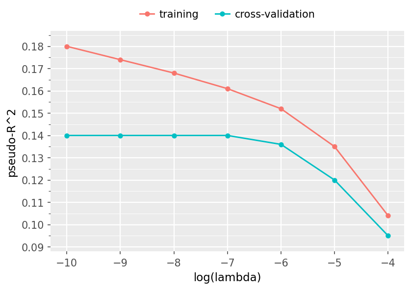

# Practice Problem 2

**Points:** 0.75

## Question

The chart shows the training and cross-validation pseudo-R^2 of a penalized frequency GLM across penalties.

**Line chart: pseudo-$R^2$ against $\log(\lambda)$** for training and cross-validation.

| $\log(\lambda)$ | training | cross-validation |
| --- | --- | --- |
| -10 | 0.180 | 0.140 |
| -9 | 0.174 | 0.140 |
| -8 | 0.168 | 0.140 |
| -7 | 0.161 | 0.140 |
| -6 | 0.152 | 0.136 |
| -5 | 0.135 | 0.120 |
| -4 | 0.104 | 0.095 |

Training fit improves monotonically as the penalty shrinks, while cross-validation flattens at 0.140 below $\log(\lambda) = -7$ — the extra flexibility buys no out-of-sample gain.

Recommend the operating penalty at which to deploy the model.

## Solution

The first key here is really to ignore the training curve, since that will continuously appear to improve as log(lambda) decreases, but really it just becomes more overfit to the training data. Then for the cross-validation curve, we would want to implement the simplest model that still gives optimal or near-optimal performance. Here that occurs at log(lambda) of -7, since with lower values of log(lambda), we will end up with a model with more parameters that according to the pseudo-R^2 values in this graph, adds no predictive power.

Select log(lambda) = -7

This results in the highest pseudo-R^2 for the validation curve, while also having a larger penalty (and thus a simpler model) compared to the lower values of log(lambda). We can ignore the training curve since that is not a good estimate of generalized performance and will overfit to the training data as log(lambda) decreases.
