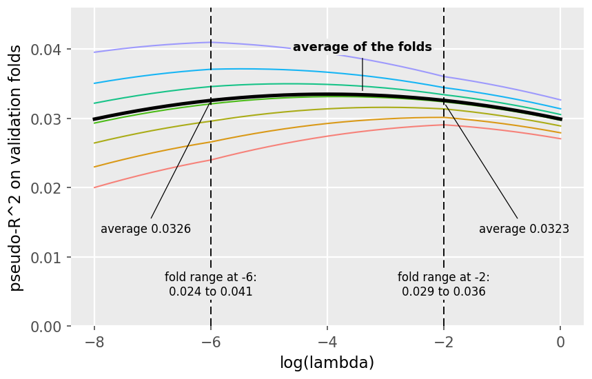

# Practice Problem 6

**Points:** 1.75

## Question

An actuary tunes the penalty strength of a LASSO claim frequency model with seven-fold cross-validation. The chart shows the validation pseudo-R-squared of each fold across the lambda grid, with the average of the folds drawn in black. The fold ranges at log(lambda) = -6 and -2 are labeled, along with the average at each.

**Cross-validation curves: pseudo-$R^2$ on validation folds against $\log(\lambda)$.** Several thin coloured lines show individual folds; a heavy black line is the *average of the folds*. The average peaks near $\log(\lambda) \approx -3.5$ at about 0.0335 and is very flat across the middle of the range. Two dashed verticals are annotated:

| $\log(\lambda)$ | average pseudo-$R^2$ | spread across folds |
| --- | --- | --- |
| -6 | 0.0326 | 0.024 to 0.041 |
| -2 | 0.0323 | 0.029 to 0.036 |

The two averages are nearly identical, but the fold-to-fold spread is much narrower at $\log(\lambda) = -2$.

### Part a (0.50 pts)

Identify the lambda the actuary should select, and briefly justify the choice.

### Part b (0.50 pts)

Describe how the agreement among the seven folds changes across the grid, quantifying it with the labeled fold ranges, and state what the pattern indicates.

### Part c (0.50 pts)

A colleague proposes selecting the lambda at which the single best-performing fold peaks. Explain a problem with that approach.

### Part d (0.25 pts)

Briefly explain why every fold's curve declines at the far right of the chart.

## Solution

### Part a

Select the lambda where the average of the folds peaks, at log(lambda) of about -4. The average across validation folds is the best estimate of out-of-sample performance.

### Part b

Fold spread at log(lambda) = -6 Fold spread at log(lambda) = -2

Lightly penalized fits are unstable, performing well or poorly depending on the data they see. Stronger penalties produce simpler fits (fewer parameters) that behave more consistently across folds.

### Part c

The best fold's peak is partly luck: the maximum of several noisy curves overstates achievable performance, and a lambda chosen based on only one fold may not generalize as well. The average across folds uses every observation for validation exactly once, so it is less noisy and immune to cherry-picking the flattering split.

### Part d

At large lambda the penalty forces the coefficients toward zero, so the model loses genuine signal and degrades toward an intercept-only fit. The decline is underfitting and appears in every fold because it reflects the model, not the split.

0.017 — `=0.041-0.024` — These are approximates from reading the graph.

0.007 — `=0.036-0.029`
