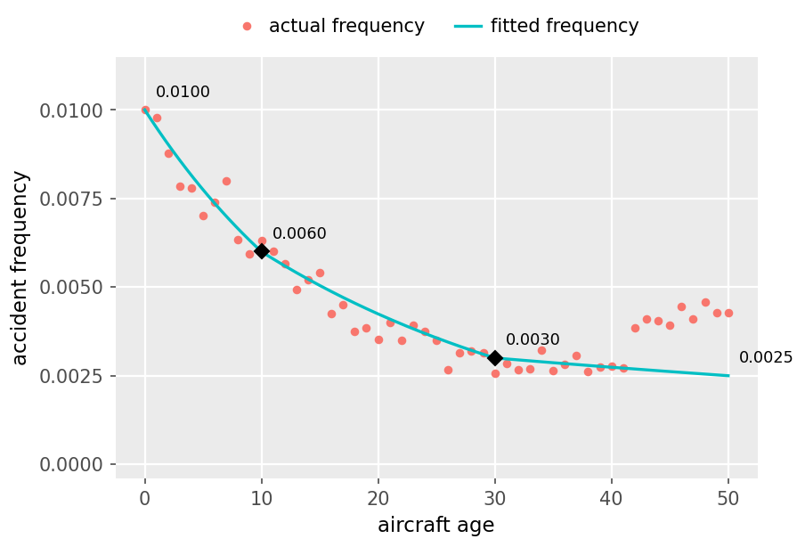

# Practice Problem 10

**Points:** 2.75

## Question

A log-link frequency GLM models aircraft age with the age variable plus hinge features whose knots are the black diamonds (ages 10 and 30) below. The log of fitted frequency is linear between knots. The labels mark the fitted curve's values at ages 0, 10, 30, and 50. Red dots are the actual frequency at each age. The model has an intercept term but no other predictor variables.

**Scatter plot: accident frequency against aircraft age, smooth fit.** Red points are actual frequency; a cyan curve is the fitted frequency, decaying smoothly. Labelled fitted values:

| Aircraft age | Fitted frequency |
| --- | --- |
| 0 | 0.0100 |
| 10 | 0.0060 |
| 30 | 0.0030 |
| 50 | 0.0025 |

Actual points track the curve closely to about age 40, then rise away from it (roughly 0.0038-0.0046) for ages 42-50, where the fitted curve keeps declining.

### Part a (0.50 pts)

Write the systematic equation for this GLM, but do not calculate any coefficients.

### Part b (1.00 pts)

Determine all coefficients used in the systematic equation for this GLM.

### Part c (0.50 pts)

Calculate the predicted accident frequency for a 60 year old aircraft.

### Part d (0.75 pts)

The knots at ages 10 and 30 were chosen based on inspecting this same chart. State a statistical objection to this approach, and suggest an alternative approach.

## Solution

### Part a

This example is identical to an example in the source paper. We are explicitly told that the log of fitted frequency is linear between knots, so we don't take the natural log of Age here.

ln(mu) = Beta0 + Beta1*Age + Beta2*max(0,Age-10) + Beta3*max(0,Age-30)

### Part b

The easiest case is that when Age=0, we only have the intercept term Beta0. Don't forget to consider the natural log.

At age=0, ln(0.01) = Beta0 — Beta0 — -4.6052 — `=LN(0.01)`

Next we can look at age 10:

At age=10, ln(0.006) = Beta0 + Beta1*10

**Beta1:** -0.0511 — `=(LN(0.006)-O9)/10`

Next we can look at age 30:

At age=30, ln(0.003) = Beta0 + Beta1*30 + Beta2*max(0,30-10)

**Beta2:** 0.0164 — `=(LN(0.003)-O9-M14*30)/(30-10)`

Finally, age 50:

At age=50, ln(0.0025) = Beta0 + Beta1*50 + Beta2*max(0,50-10) + Beta3*max(0,50-30)

**Beta3:** 0.0255 — `=(LN(0.0025)-O9-M14*50-M19*(50-10))/(50-30)`

### Part c

At age=60, ln(mu) = Beta0 + Beta1*60 + Beta2*max(0,60-10) + Beta3*max(0,60-30)

**ln(mu):** -6.082625 — `=O9+M14*60+M19*(60-10)+M24*(60-30)`

Predicted freq — 0.0023 — `=EXP(M28)` — <--- we can easily confirm this value looks reasonable based on the graph too

### Part d

The issue with choosing knots based on a graph like this is that it can result in overfitting.

From the source text:

"Besides being time-consuming if we were to do this for every continuous dependent variable, it is also suboptimal as we may be misled by patterns that we think we see in the data which are actually just noise."

An alternative approach is to use a lasso or elastic net model and create a knot at every age, and let the penalty only keep the hinges that optimize k-fold cross-validation performance.
