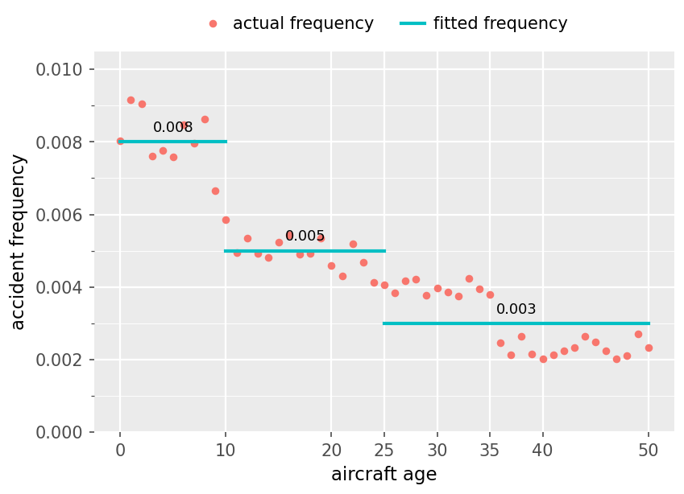

# Practice Problem 12

**Points:** 2.25

## Question

A log-link frequency GLM models aircraft age with the age variable plus step functions. The teal steps below are the fitted levels. Red dots are the actual frequency at each age. The model has an intercept term but no other predictor variables.

**Scatter plot: accident frequency against aircraft age, step fit.** Red points are actual frequency; cyan horizontal segments are the fitted frequency, piecewise constant across binned age ranges:

| Aircraft age band | Fitted frequency |
| --- | --- |
| 0-10 | 0.008 |
| 10-25 | 0.005 |
| 25-50 | 0.003 |

Actual frequency declines steadily and continuously from about 0.009 at age 0 to roughly 0.002 at age 50, so the three-step fit systematically over- and under-shoots within each band — the contrast with the smooth fit for the same data.

### Part a (0.50 pts)

Write the systematic equation for this GLM, but do not calculate any coefficients.

### Part b (0.75 pts)

Determine all coefficients used in the systematic equation for this GLM.

### Part c (0.50 pts)

Calculate the predicted accident frequency for a 60 year old aircraft.

### Part d (0.50 pts)

State the behavior of this model beyond age 50 and why that differs from a model that uses hinge functions instead of step functions.

## Solution

### Part a

ln(mu) = Beta0 + Beta1*Step1 + Beta2*Step2 where:

Step1 = 1 if Age>=10, 0 otherwise Step2 = 1 if Age>=25, 0 otherwise

### Part b

The easiest case is that when Age<10, we only have the intercept term Beta0. Don't forget to consider the natural log.

At age=0, ln(0.008) = Beta0 — Beta0 — -4.8283 — `=LN(0.008)`

Next we can look at age 10:

At age=10, ln(0.005) = Beta0 + Beta1*1

**Beta1:** -0.4700 — `=LN(0.005)-O9`

Next we can look at age 30:

At age=30, ln(0.003) = Beta0 + Beta1*1 + Beta2*1

**Beta2:** -0.5108 — `=LN(0.003)-O9-M14`

### Part c

At age=60, ln(mu) = Beta0 + Beta1*Step1 + Beta2*Step2 = Beta0 + Beta1 + Beta2

**ln(mu):** -5.8091 — `=O9+M14+M19`

Predicted freq — 0.0030 — `=EXP(M23)` — <--- you could also just read this from the graph directly since that last step line will stay flat past age 50

### Part d

The final step runs flat forever: any aircraft older than 50 gets the same relativity as for age 50. A hinge model would keep extending its final slope, so its predictions for very old aircraft keep falling (or rising) without data. A step function being flat allows less flexibility within a range compared to hinge functions, but is safer when extrapolated beyond that range.
